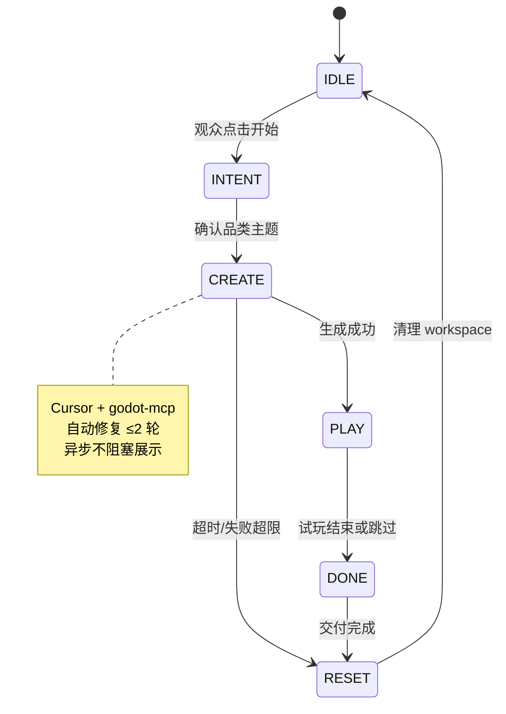

# AI 小游戏创作工坊 · 系统业务流程说明 v1.0

> **版本**：v1.0 · 2026-06-11  
> **对齐**：Session 六态 · 功能点明细 v1.0  
> **静态图**：[`静态图/business-flow.mmd`](./静态图/business-flow.mmd)  
> **交互版（规划）**：`6.3功能点与效果示意图/04_业务流程图.jsx`

---

## 1. 业务闭环总览

**参观者动线**：走近展台 → 选主题 → 看 AI 创作 → 试玩 → 扫码带走 → 复位  
**时长目标**：单场 **8–10 分钟** · 单阶段超时见下表 · 全场 RESET ≤60s



---

## 2. 泳道分工

| 泳道 | 参与方 | 主要职责 |
|------|--------|----------|
| 参观者 | 6–15 岁学生/亲子 | 选主题、试玩、扫码 |
| Kiosk | 55″ 立式屏 | 需求采集、成果 QR |
| 过程横屏 | 49″ 屏 | 创作过程、试玩画面 |
| 编排中枢 | FastAPI · 状态机 · Redis | 阶段推进、队列、广播 |
| AI 制作 | Cursor · godot-mcp · Godot | 模板实例化、改代码、运行 |
| 产物服务 | MinIO | exe/录屏存储 |
| 讲解员 | 工作人员 | 复位、审核上墙、异常降级 |

---

## 3. 分阶段业务步骤

### IDLE → INTENT（需求采集）

| 步骤 | 泳道 | 业务动作 | 关键事件 |
|------|------|----------|----------|
| 1 | 参观者 | 走近展台，触屏「开始」 | — |
| 2 | Kiosk | 展示品类矩阵（7 类） | `ui_genre_select` |
| 3 | 参观者 | 选品类 + 主题 + 学段难度 | `session_create` |
| 4 | 编排 | 创建 Session，分配 workspace 路径 | `stage_change: INTENT` |
| 5 | Kiosk | 确认页「开始创作」 | `generate_start` |

**超时**：3min 无操作 → RESET

### INTENT → CREATE（AI 创作）

| 步骤 | 泳道 | 业务动作 | 关键事件 |
|------|------|----------|----------|
| 6 | 编排 | 复制模板 → workspace/{id} | `template_copied` |
| 7 | 编排 | 填充 Prompt，触发 Cursor | `agent_started` |
| 8 | 横屏 | 显示阶段 ① 匹配模板 | `gen_progress: 10%` |
| 9 | AI 制作 | Agent 修改 GDScript/配置 | `gen_log: editing` |
| 10 | 横屏 | 阶段 ②③ 写代码 / 试运行 | `gen_progress: 40–70%` |
| 11 | AI 制作 | godot-mcp run_project | `gen_log: running` |
| 12 | AI 制作 | 若有 ERROR：fix ≤2 轮 | `gen_log: fixing` |
| 13 | AI 制作 | export 或 run 就绪 | `gen_progress: 100%` |
| 14 | 编排 | 推进 PLAY | `stage_change: PLAY` |

**超时**：6min → 降级 demo_preset 或 RESET

### CREATE → PLAY（试玩）

| 步骤 | 泳道 | 业务动作 | 关键事件 |
|------|------|----------|----------|
| 15 | 横屏 | 全屏启动游戏 | `play_started` |
| 16 | 参观者 | 键鼠试玩 2–3min | — |
| 17 | 参观者 | 点「完成」或超时 | `play_ended` |
| 18 | 编排 | 推进 DONE | `stage_change: DONE` |

### PLAY → DONE → RESET（交付）

| 步骤 | 泳道 | 业务动作 | 关键事件 |
|------|------|----------|----------|
| 19 | 产物 | 写入 MinIO；生成签名 URL | `artifact_ready` |
| 20 | Kiosk | 展示 QR + 作品摘要 | `qr_display` |
| 21 | 参观者 | 扫码下载（可选） | — |
| 22 | 参观者 | 可选留昵称 → 讲解员审核上墙 | `wall_submit` |
| 23 | 编排 | 推进 RESET，清理 workspace | `stage_change: RESET` |
| 24 | 全屏 | 回 IDLE 待机 | `stage_change: IDLE` |

---

## 4. 并行分支：全馆路演素材

```text
PLAY 试玩中 → 屏录高光（可选）
           → 写入路演厅素材池 tagging=gameforge
           → 全馆成片可引用「今日我做了小游戏」章节
```

**业务规则**：屏录 **不阻塞** 主流程；失败静默忽略。

---

## 5. 核心业务规则

1. **单一真相源**：Python 状态机 ≡ `session.state.ts` ≡ Socket 广播字段  
2. **Session 隔离**：每个观众独立 `workspace/{session_id}`  
3. **Scope 限制**：单次会话只改一个品类模板，禁止新系统  
4. **自动修复上限**：2 轮；仍失败走 demo_preset  
5. **演示优先级**：exe > Godot run > 预录视频 > Web  
6. **内容安全**：敏感词拦截；14 岁以下无暴力血腥  
7. **讲解员**：可 `operator_reset` 强制 RESET  

---

## 6. 阶段超时表

| 状态 | 超时 | 动作 |
|------|------|------|
| INTENT | 3min | → RESET |
| CREATE | 6min | → demo_preset 或 RESET |
| PLAY | 5min | → DONE |
| DONE | 2min | → RESET |
| RESET | 60s | 必须回 IDLE |

---

## 7. 汇报演示顺序（建议）

1. **业务流** — 非技术听众理解「10 分钟做小游戏」  
2. **架构图** — 技术/甲方看 Cursor+Godot 分工  
3. **功能点明细 §1.2** — 体验岛平面  
4. **Live Demo** — MCP run 一个 platformer 定制（若环境就绪）

---

## 8. 相关文档

| 文档 | 说明 |
|------|------|
| [`系统架构说明_v1.0.md`](./系统架构说明_v1.0.md) | 四层架构 |
| [`../AI生成小游戏_功能点明细与开发计划_v1.0.md`](../AI生成小游戏_功能点明细与开发计划_v1.0.md) | 互动步骤详表 |

---

*v1.0 · 与 `静态图/business-flow.mmd` 同步维护*
