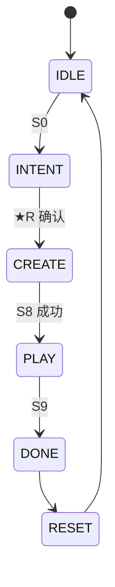

# AI 小游戏创作工坊 · 系统业务流程说明 v1.3

> **版本**：v1.3 · 2026-06-20  
> **对齐**：[`AI创作引导流程_v1.0.md`](../模板引擎/AI创作引导流程_v1.0.md) **v1.1** · [`config/wizard_steps.json`](../../config/wizard_steps.json)  
> **静态图**：[`静态图/business-flow.mmd`](./静态图/business-flow.mmd)

---

## 1. 业务闭环总览

**参观者动线**：起名 → **S0–S7 向导（实时预览）** → **★R 配方确认** → 分步 AI 制作 → 试玩（作品名）→ 作品卡 → 复位  
**时长**：≤**10 分钟**（引导 ~5.5min + CREATE 3–4min + PLAY 2–3min）  
**终端**：10× Web/Kiosk · 双栏 UI（左步骤 / 右预览）

---

## 2. INTENT：S0–S7 + ★R（v1.1 客制化）

| 步 | 业务动作 | 写入 | 预览 | 事件 |
|----|----------|------|------|------|
| **S0** | 欢迎 + **游戏命名** | `meta.display_name` | — | `wizard_step:S0` |
| S1 | 11 品类 | `meta.genre` | ✅ 动图 | `ui_genre_select` |
| S2 | 玩法子模式/跳转 | `meta.play_variant` | ✅ morph | `play_variant_resolve` |
| S3 | 风格 | `theme.style_pack` | ✅ 换色 | `theme_style` |
| S4 | 人物（Kenney/AI） | `theme.character` | ✅ 立绘 | `character_define` |
| S5 | 道具 | `theme.props[]` | ✅ 挂载 | `props_define` |
| S6 | 手感卡片 | `tuning` preset | ✅ 微动画 | `tuning_intent` |
| S7 | 小技能 ≤2 | `tuning.enabled_skills` | ✅ 图标 | `skills_select` |
| **★R** | **创作配方确认** | — | ✅ 汇总 | `wizard_recap_confirm` |
| — | 开始制作 | → CREATE | — | `generate_start` |

**UI 固定元素**：顶部 `创作进度 n/8` + 作品名；右侧「我的小游戏」预览区。

**超时**：INTENT+★R 累计 **5.5min** → preset 快捷入口  
**L0**：S0 可简化 · S1 后 → demo_preset → PLAY

---

## 3. CREATE：S8 分步生成

| 阶段 | 观众看到 | 后台 |
|------|----------|------|
| 10–25% | 「搭建《{名}》…」「换上 {风格}…」 | 复制 template |
| 40–85% | 「{主角}登场」「装备 {道具}」「激活 {技能}」 | Agent 改 config · 可选生图 |
| 100% | 「诞生完成！」+ 可选 demo vs 你的对比 | MCP run · fix≤2 |

失败 → `demo_preset` → 仍 PLAY（标题仍用用户命名）

---

## 4. PLAY / DONE

- **S9** 标题屏显示 `meta.display_name`
- 结束 → **作品卡**（名+截图+可选 QR）
- 研学：批量上墙

---

## 5. 规则摘要

| 主题 | 规则 |
|------|------|
| 客制化感知 | 每步 3s 内更新预览 · ★R 配方 · S8 绑定文案 |
| 技能 | `optional_skills.json` · 最多 2 · core 预制 |
| 玩法融合 | `play_variants.json` 跳转，不合并 template |
| 美术 | Kenney 默认 · AI 生图可选 · 失败 fallback |
| 权限 | Agent 只改 `game_config.json` tuning/theme/skills |

---

## 6. 超时

| 阶段 | 超时 | 动作 |
|------|------|------|
| INTENT+★R | 5.5min | preset / RESET |
| CREATE | 6min | demo_preset |
| PLAY | 5min | DONE |
| RESET | 60s | IDLE |

---

## 7. 相关文档

| 文档 | 说明 |
|------|------|
| [`AI创作引导流程_v1.0.md`](../模板引擎/AI创作引导流程_v1.0.md) | v1.1 逐步+调研 |
| [`AI生成小游戏_前期准备与待办_v1.2.md`](../AI生成小游戏_前期准备与待办_v1.2.md) | **§十 你现在应做什么** |
| [`assets/kenney/README.md`](../../assets/kenney/README.md) | Kenney 说明 |

---

*v1.3 · 2026-06-20 · 对齐引导流程 v1.1 客制化感知*
