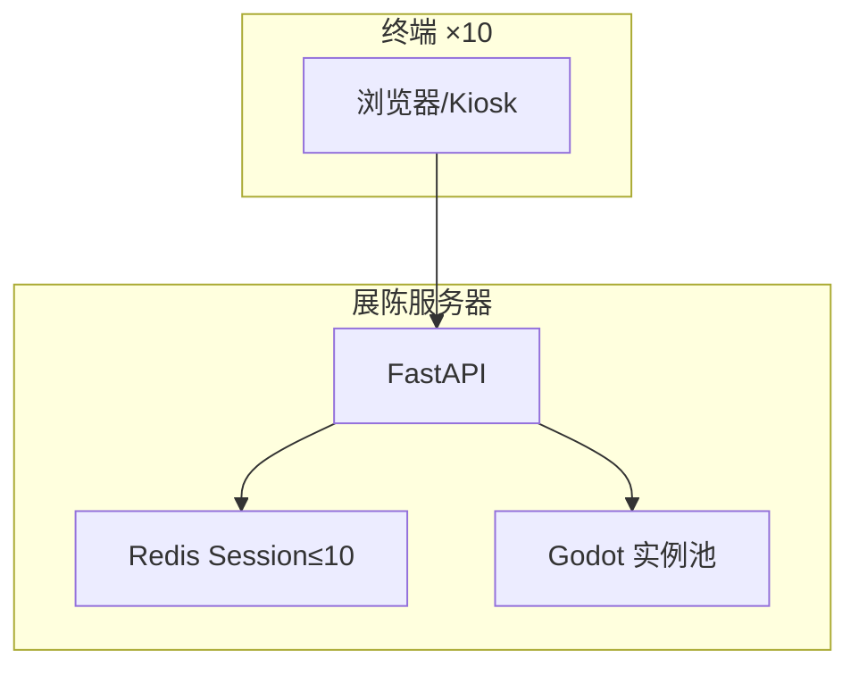
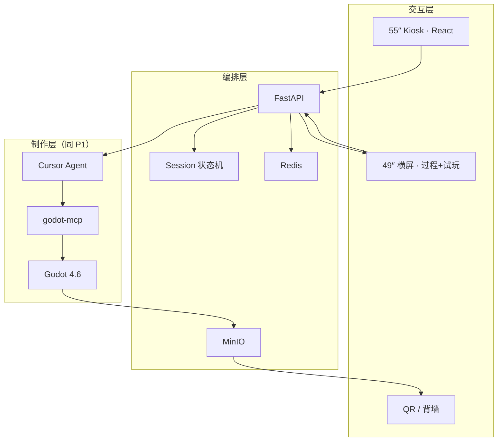

# AI 小游戏创作工坊 · 系统架构说明 v1.2

> **版本**：v1.2 · 2026-06-19 · **D10 展厅上线 · 10 并发 · 11 品类**  
> **对齐**：[`AI生成小游戏_十天上线路线_v1.2.md`](../AI生成小游戏_十天上线路线_v1.2.md)  
> **静态图**：[`静态图/system-architecture.mmd`](./静态图/system-architecture.mmd)

---

## 1. 架构总览（v1.2 · 展厅服务器）

v1.2 **以展陈服务器为中心**：终端经局域网访问；服务器托管 **FastAPI + Redis（≤10 Session）** 与 **Godot 单机游戏实例**；游戏为 **exe/子进程**，非 MMO 联机。



> v1.1「Phase 1 本地 / Phase 3 展陈」两阶段 **合并为 D1–D10 单线交付**。

### 1.1 Phase 1 — 制作核（当前）

```mermaid
flowchart TB
    subgraph INPUT["输入"]
        USER[开发者 / 讲解员<br/>Cursor 对话]
        RAG[本地 RAG<br/>gameforge_rag.db]
    end

    subgraph CREATION["制作层 CREATION"]
        CURSOR[Cursor Agent]
        RULES[.cursor/rules<br/>core_locked]
        PROMPT[prompts/{genre}.md]
        MCP[godot-mcp]
        GODOT[Godot 4.6 + GDScript]
        TPL[templates/{genre}/<br/>core 🔒 + config ✅]
        WS[workspace/{session_id}/]
    end

    subgraph DEMO["演示层 DEMO"]
        RUN[Godot Run]
        EXE[Windows exe]
    end

    USER --> CURSOR
    RAG --> CURSOR
    PROMPT --> CURSOR
    RULES --> CURSOR
    CURSOR --> MCP
    TPL --> WS
    MCP --> GODOT
    WS --> GODOT
    GODOT --> RUN
    GODOT --> EXE
```

### 1.2 Phase 3 — 展陈全栈（推迟）



---

## 2. 分层职责

| 层级 | v1.2 | 模块 | 职责 |
|------|------|------|------|
| **终端层** | D6 | Web/Kiosk ×10 | 选 11 品类 · 排队 · 启动试玩 |
| **编排层** | D1 | FastAPI · Redis · nginx | **Session≤10** · 路由 · 复位 |
| **游戏层** | D3–D5 | Godot exe ×11 preset | **单机**试玩实例 |
| **制作层** | 持续 | MCP · templates · RAG | core 预制 · L1 改 config |
| **数据层** | D6 | MinIO · workspace/ | preset · 导出包 |

---

## 3. 终端分工

| 展厅终端 ×10 | `/lobby` `/play` | Web + WS | **D6** |
| 展陈服务器 | FastAPI :8000 | Python | **D1** |
| 开发机 | Cursor + Godot | MCP | 模板开发 |

---

## 4. 数据流（P1 核心路径）

```text
用户意图
  → query_rag.py（可选，Agent 自动）
  → 复制 templates/{genre} → workspace/{id}
  → Cursor 按 prompts/{genre}.md 仅改 game_config.json
  → godot-mcp run_project
  → [失败] get_debug_output → fix ≤2 轮
  → [仍失败] 回退 demo_preset
  → Godot run / export exe
```

---

## 5. 安全与约束

| 约束 | 实现 |
|------|------|
| core 不可改 | `.cursor/rules/godot-mini-game.mdc` |
| tuning 幅度 | ±30% 默认（见品类核心参数规格） |
| 素材来源 | `assets/kenney/` 白名单 |
| 内容安全 | P3：敏感词过滤；P1：讲解员审核 |
| 超时降级 | demo_preset 硬回退 |

---

## 6. 与调研/RAG 的关系

| 组件 | 路径 | 作用 |
|------|------|------|
| 原始检索 | `data/游戏设计与AI创作调研/report_*.json` | Survey-01 **1024** 条 |
| 用户向检索 | `data/K12用户向调研/report_*.json` | Survey-02 **600** 条 |
| 整合报告 | Survey-01 + **Survey-02** `K12用户向调研整合.md` | 技术 + 用户可读结论 |
| RAG 索引 | `rag/index/gameforge_rag.db` | **1348 chunks** |
| 查询脚本 | `05-工具脚本/query_rag.py` | Agent/人工检索 |

---

*v1.2 · 2026-06-19 · 展厅服务器 · 10 并发*
