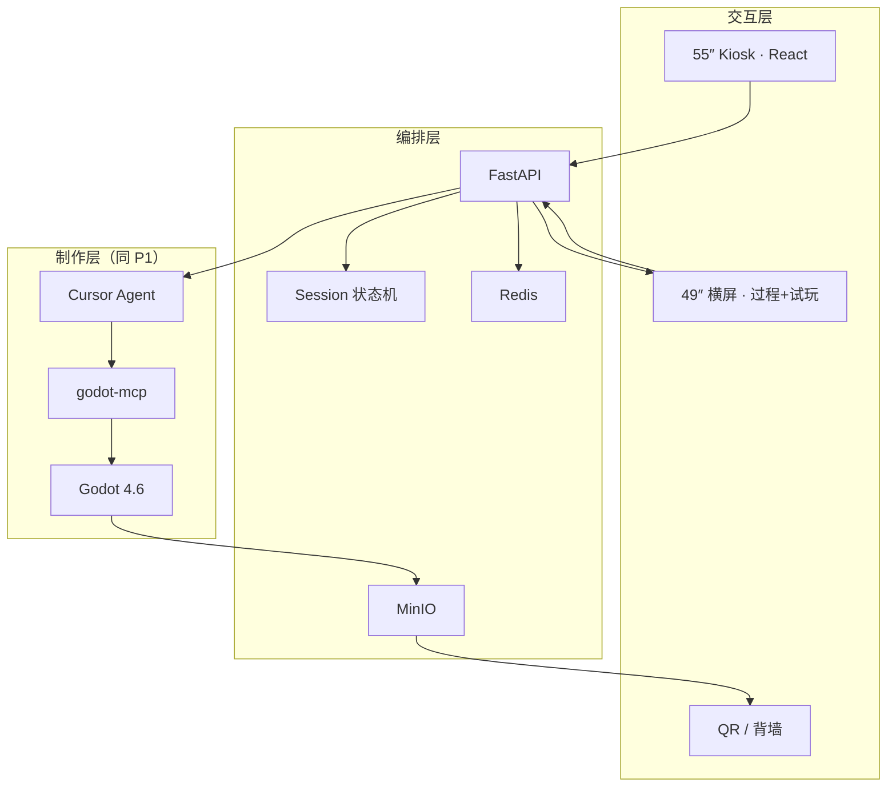

# AI 小游戏创作工坊 · 系统架构说明 v1.1

> **版本**：v1.1 · 2026-06-13  
> **对齐**：技术选型 v1.1 · 功能点明细 v1.1 · 独立评审 71.74→77.6  
> **静态图**：[`静态图/system-architecture.mmd`](./静态图/system-architecture.mmd)  
> **交互版（规划）**：`6.3功能点与效果示意图/03_软硬件架构图.jsx`

---

## 1. 架构总览（两阶段）

v1.1 将架构拆为 **Phase 1 制作核**（当前开发）与 **Phase 3 展陈全栈**（硬件到位后追加）。核心生成链路始终 **本地离线**；云端 LLM 仅经 Cursor 可选调用。

### 1.1 Phase 1 — 制作核（当前）

```mermaid
flowchart TB
    subgraph INPUT["输入"]
        USER[开发者 / 讲解员<br/>Cursor 对话]
        RAG[本地 RAG<br/>gameforge_rag.db]
    end

    subgraph CREATION["制作层 CREATION"]
        CURSOR[Cursor Agent]
        RULES[.cursor/rules<br/>core_locked]
        PROMPT[prompts/{genre}.md]
        MCP[godot-mcp]
        GODOT[Godot 4.6 + GDScript]
        TPL[templates/{genre}/<br/>core 🔒 + config ✅]
        WS[workspace/{session_id}/]
    end

    subgraph DEMO["演示层 DEMO"]
        RUN[Godot Run]
        EXE[Windows exe]
    end

    USER --> CURSOR
    RAG --> CURSOR
    PROMPT --> CURSOR
    RULES --> CURSOR
    CURSOR --> MCP
    TPL --> WS
    MCP --> GODOT
    WS --> GODOT
    GODOT --> RUN
    GODOT --> EXE
```

### 1.2 Phase 3 — 展陈全栈（推迟）



---

## 2. 分层职责

| 层级 | Phase | 模块 | 职责 |
|------|-------|------|------|
| **知识层** | P1 | RAG + 调研整合 | 降幻觉；为 Prompt 提供可引用依据 |
| **制作层** | P1 | Cursor · MCP · Godot · 模板 | core 预制；AI **仅改 config**；运行调试 |
| **演示层** | P1 | Runtime / exe | 可玩产物 |
| **交互壳** | P2 | Godot menu.tscn | 过渡：本地选品类/主题 |
| **交互层** | P3 | Kiosk / 横屏 / QR | 观众需求采集、过程可视化、试玩 |
| **编排层** | P3 | FastAPI · Redis · Socket | Session 隔离、排队、进度广播 |
| **数据层** | P3 | MinIO · workspace/ | 导出包、屏录、二维码 |

---

## 3. 终端分工

| 终端 | 路由/输出 | 技术栈 | 阶段 |
|------|-----------|--------|------|
| 开发者 PC | Cursor + Godot | MCP + CLI | **P1 起** |
| Godot 菜单 | 品类/主题选择 | GDScript UI | P2 |
| 55″ Kiosk | `/kiosk` | React | P3 |
| 49″ 横屏 | `/process` `/play` | React + Socket | P3 |
| 主控机柜 | FastAPI :8000 | Python | P3 |

---

## 4. 数据流（P1 核心路径）

```text
用户意图
  → query_rag.py（可选，Agent 自动）
  → 复制 templates/{genre} → workspace/{id}
  → Cursor 按 prompts/{genre}.md 仅改 game_config.json
  → godot-mcp run_project
  → [失败] get_debug_output → fix ≤2 轮
  → [仍失败] 回退 demo_preset
  → Godot run / export exe
```

---

## 5. 安全与约束

| 约束 | 实现 |
|------|------|
| core 不可改 | `.cursor/rules/godot-mini-game.mdc` |
| tuning 幅度 | ±30% 默认（见品类核心参数规格） |
| 素材来源 | `assets/kenney/` 白名单 |
| 内容安全 | P3：敏感词过滤；P1：讲解员审核 |
| 超时降级 | demo_preset 硬回退 |

---

## 6. 与调研/RAG 的关系

| 组件 | 路径 | 作用 |
|------|------|------|
| 原始检索 | `03-背景与调研/data/.../report_*.json` | 1024 条来源 |
| 整合报告 | `游戏设计与AI创作-调研整合.md` | 人类可读结论 |
| RAG 索引 | `rag/index/gameforge_rag.db` | 882 chunks |
| 查询脚本 | `05-工具脚本/query_rag.py` | Agent/人工检索 |

---

*v1.1 · 2026-06-13*
