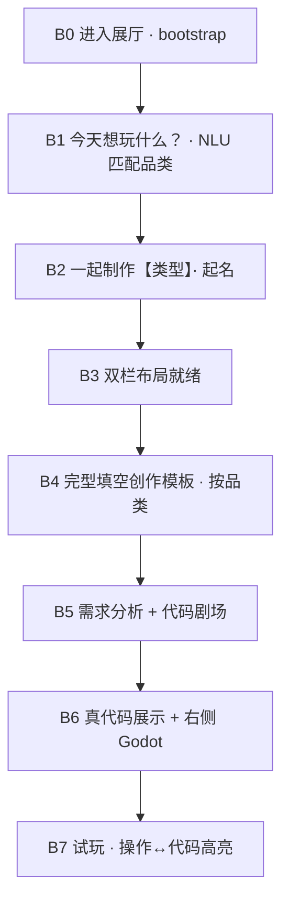

# 6.24 · B 链教育版用户旅程与需求规格 v1.0

> **日期**：2026-06-24  
> **状态**：**评审通过** · 分期实现（P0 进行中）  
> **定位**：展厅 **教育创作区**（非纯游戏体验区）  
> **受众**：K12 · 14 岁以下 · 触控大屏  
> **前置**：精选 7 款 A 深 R2 已验收 · A 链快速试玩保留 · B 链 **重构为教育导向**  
> **关联**：[`6.23_R2对齐执行规范手册_v1.0.md`](./6.23_R2对齐执行规范手册_v1.0.md) · [`kiosk_ui_spec.json`](../../config/kiosk_ui_spec.json) · [`b_chain_isolation`](../../config/kiosk_ui_spec.json)（workspace 隔离，继续有效）

---

## 一、需求变更摘要（相对 6.23 B 链）

| 维度 | 6.23 已实现 B 链 | **6.24 新 B 链（本规格）** |
|------|-------------------|---------------------------|
| 品类选择 | S1 点选 7 宫格卡片 | **自然语言**「今天想玩什么？」→ **AI 匹配**品类 |
| 命名顺序 | 先起名再选游戏（S0→S1） | **先定类型再起名**；推荐名 **按品类预制** |
| 布局 | 左操作 + 右静态预览图 | **左伪工作区（代码）** + **右 Godot 实况** |
| 创作表单 | S2–S7 通用向导步 | **每品类完型填空 + 下拉**（少碰美术） |
| 「AI 制作」 | 本地 merge `game_config`（无 LLM） | **需求分析 API**：简单→预制参数；复杂→**大模型 / Cursor API** |
| 制作过程展示 | S8 转圈 + 四步文案 | **左侧滚动代码剧场**（预制滚动素材，非实时流式） |
| 试玩后教育 | 无 | **操作 ↔ 代码块高亮联动**（核心教育价值） |
| 隔离鲁棒性 | workspace 副本 · release · bootstrap | **延续并加强**（见 §八） |

**不变项**

- 展陈运行时仍为 **Godot**；秒哒 H5 仅参考，不作交付物。
- **禁止**用户创作改动 `templates/{slug}/` 原件；写入仅限 `workspace/{session_id}/`。
- 仍只改 **`config/game_config.json`** 与规范允许的 **workspace 内补丁**；`core/` 预制逻辑优先，LLM 仅在有白名单时补小块。

---

## 二、产品目标（教育版一句话）

> 让小朋友用自然语言说出想玩的游戏，在 **看得见的代码工作区** 里完成「像程序员一样」的创作仪式，并在试玩时 **立刻看懂「我点的操作 ↔ 哪段代码」**，建立 AI 辅助编程的直观认知。

**成功标准（展陈）**

1. 儿童能在 **3 分钟内** 完成「说想法 → 起名 → 填 3–5 个空」。
2. 制作阶段 **左侧代码滚动** 被讲解员称为「AI 在写代码」且无卡顿/黑屏。
3. 试玩时 **≥1 次** 操作触发左侧高亮，儿童能复述「是这段让我跳得更高」。
4. 换用户、关页、崩溃后 **下一位** 可正常开始，模板库无污损。

---

## 三、用户旅程（B 链 · 7 阶段）



### B0 · 进入展厅

| 项 | 说明 |
|----|------|
| 触发 | 打开 Kiosk `/kiosk/`，默认进入 B 链教育模式（或 A/B 入口分流，B 为「创作工坊」） |
| 系统 | `GET /bootstrap`：7 款模板校验 · 清理孤立 workspace · Godot 路径检查 |
| 用户看到 | 品牌顶栏 + 「欢迎来到 AI 游戏创作工坊」 |
| 失败 | 阻塞 UI，仅保留「重新开始 / 呼叫老师」 |

---

### B1 · 「今天你想玩什么游戏呢？」

| 项 | 说明 |
|----|------|
| 界面 | 大输入框（语音可选二期）+ 示例提示：「我想打飞机」「想玩马里奥那种」 |
| 用户操作 | 自由输入一句话 |
| **API** | `POST /intent/match-genre`（新建） |
| 后端逻辑 | NLU：关键词 + 可选 LLM 分类 → 映射到 7 slug 之一；置信度低时追问或展示 3 张候选卡 |
| 输出 | `matched_genre` · `confidence` · `reply_text`（如「听起来你想玩射击类的飞机游戏！」） |
| 数据 | 写入 `session.payload.intent_raw` · `meta.genre` |

**7 款可匹配域**

| slug | 匹配意图示例 |
|------|----------------|
| platformer | 马里奥、闯关、跳平台、踩怪物 |
| shmup | 飞机、射击、雷霆、打飞机 |
| survivor | 割草、生存、升级、打怪变强 |
| pingpong | 乒乓球、弹球、双人对打 |
| fighting | 格斗、拳击、对战、双人打架 |
| parkour | 跑酷、一直跑、躲障碍 |
| racing | 赛车、开车、竞速、跑道 |

---

### B2 · 「我知道了！我们一起制作一个【游戏类型】吧！你希望它叫什么呢？」

| 项 | 说明 |
|----|------|
| 界面 | 品类图标 + 确认文案 + 名字输入 + **品类预制推荐名芯片** |
| **API** | `GET /creative/name-suggestions?genre={slug}` 或内嵌于 `kiosk_ui_spec` |
| 用户操作 | 输入或点推荐名 |
| 输出 | `meta.display_name` · `theme.title` |

**推荐名预制（首期示范，可配置化）**

| slug | 推荐名（示例 4 个） |
|------|---------------------|
| platformer | 星星大冒险、跳跳小子、管道奇遇、金币猎人 |
| shmup | 雷霆小队、星空守护者、小小飞行员、弹幕闪避 |
| survivor | 糖果幸存者、怪物克星、时间大作战、升级小英雄 |
| pingpong | 弹弹乐、乒乓对决、教室球王、快慢球 |
| fighting | 像素拳王、双人对决、校园格斗赛、闪电出拳 |
| parkour | 无尽奔跑、障碍小子、滑铲达人、晨跑冒险 |
| racing | 欢乐赛车、弯道之王、小小车手、冲刺吧 |

---

### B3 · 双栏工作区布局

| 区域 | 命名 | 内容 |
|------|------|------|
| **左侧** | `{display_name}` 工作区 | 伪 IDE：文件树 + 代码区 + 行号；顶部显示作品名 |
| **右侧** | Godot 预览窗 | SubViewport / 嵌入 Godot 导出画面；**自动 contain 缩放** |
| 顶栏 | 进度 | B1–B7 阶段点或「创作 / 制作 / 试玩」三段 |

**布局约束**

- 左侧 ≥ 45% 宽；右侧 Godot 区域固定比例（参考 racing 540×960 contain）。
- 儿童触控：左侧以 **滚动+高亮** 为主，不做真实编辑（只读展示，防误触）。

---

### B4 · 品类创作模板（完型填空 + 下拉）

**原则**

- **尽量不新增美术资源**；仅 `tuning` / `theme.title` / `enabled_skills` / 已有 theme 色值。
- 每品类 **3–6 题**，题型：`填空` · `单选` · `滑块（离散档）`。
- 每题绑定 `tuning_path` 或 `skill_id`，由后端映射表解析（非 LLM 猜测）。

#### 4.1 题型示例（跨品类）

```text
你希望【主角/飞机/赛车】能够【跑得快一点 / 跳得高一些 / 射得快一些】
你希望游戏【更轻松 / 刚刚好 / 更有挑战】
你希望开启技能【下拉：二选一预制技能】
```

#### 4.2 七品类首期模板草案（需逐款对照 core 校准）

| slug | 完型填空示例 | 映射 tuning（示例） |
|------|-------------|---------------------|
| **platformer** | 主角移动要【慢一点/刚刚好/快一点】；跳跃要【低一点/刚刚好/高一点】；敌人要【少而慢/默认/多而快】 | `player.move_speed` · `player.jump_velocity` · `enemy.patrol_speed` |
| **shmup** | 飞机移动【慢/中/快】；子弹【稀/中/密】；敌机【慢/中/快】 | `player.speed` · `player.bullet_interval_ms` · `enemy_types.*.speed` |
| **survivor** | 移动【慢/中/快】；刷怪【疏/中/密】；一局时长感受【轻松/标准/紧张】 | `player.speed` · `spawn` 相关 · `match_duration` |
| **pingpong** | 球速【慢/中/快】；人机【弱/中/强】；获胜分数【3/5/7】 | `ball.speed` · `ai.*` · `win.score` |
| **fighting** | 角色移动【慢/中/快】；攻击力【弱/中/强】；开启招式【下拉技能】 | `move_speed` · `damage` · `enabled_skills` |
| **parkour** | 跑步速度【慢/中/快】；跳跃【低/中/高】；障碍【少/中/多】 | `run_speed` · `jump_velocity` · `obstacle_density` |
| **racing** | 最高速度【慢/中/快】；转向【灵/中/钝】；比赛时长感受【短/中/长】 | `max_speed` · `turn_rate` · `race_duration` |

> **交付前**：每题须在 `{slug}_creative_template.json` 中写明 `question_id` · `widget` · `options[]` · `tuning_delta` · `code_anchor_id`（供 B7 高亮）。

**API**

- `GET /creative/templates/{genre}` → 返回表单 schema
- `POST /sessions/{id}/creative/answers` → 校验并写入 `session.payload.creative_answers`

---

### B5 · 需求分析 + 代码剧场（「AI 正在创作」）

| 项 | 说明 |
|----|------|
| 触发 | 用户点击「开始制作」 |
| **API 1** | `POST /sessions/{id}/analyze-requirements` |
| 分析结果 | 每题标记 `resolution: preset | llm_patch` |
| **preset** | 直接写 `tuning` 数值（±30% clamp）· 开关 `enabled_skills` |
| **llm_patch** | 调用 **大模型 API** 或 **Cursor Agent API**，在 workspace 内生成 **白名单文件**（见 §六） |
| 左侧 UI | **多文件伪工作区剧场**（v1.1 · 2026-06-24）：按 `config/edu_workspace_trees.json` 自上而下浮现 8–9 个真实路径；每文件从 `GET /edu/preview/{genre}/file` 拉取模板节选并打字展示；树宽 260px、可滚动 |
| 备选 | 旧版单文件 `assets/code_theater/{genre}.jsonl` 已由多文件剧场替代；`kiosk_edu_spec.json` → `theater.multi_file_reveal: true` |
| 注意 | 滚动内容 **不必是实时 LLM 输出**；与模板库同源，避免长等待；**展示不参与运行** |

**API 2（执行）**

```http
POST /sessions/{id}/generate/v2
```

流水线：

1. `copytree` → `workspace/{session_id}/`（与现 B 链相同）
2. 应用 `preset` 补丁 → `game_config.json`
3. 若有 `llm_patch` → 异步任务写 workspace 内允许的文件
4. 返回 `workspace_path` · `code_map`（锚点表）

**左侧状态机**

```text
theater_scrolling（预制动画）
    → applying（真合并）
    → ready（展示真实 game_config + 关键 .gd 片段）
```

---

### B6 · 真代码展示 + 右侧启动 Godot

| 项 | 说明 |
|----|------|
| 左侧 | **真实** `workspace/.../config/game_config.json` 高亮 + 文件树可点击：`config/`、`core/` 读 workspace；`scenes/`、`project.godot` 读预览 API |
| 右侧 | `POST /sessions/{id}/play/launch` 启动 Godot，窗口 **自动 fit** |
| 文案 | 「这就是 AI 根据你的选择生成的游戏！」 |

---

### B7 · 试玩 · 操作 ↔ 代码联动（教育核心）

| 项 | 说明 |
|----|------|
| 机制 | Godot 通过 **调试桥**（WebSocket / 文件信号 / MCP 事件）上报 `action_id` |
| 左侧 | 滚动到 `code_map[action_id]` 对应行 · **高亮 2s** · 可选气泡「你刚才跳了一下，就是这里！」 |
| 首期 action 集（每品类 ≥3） | 如 platformer：`jump` · `stomp_enemy` · `collect_coin`；shmup：`fire` · `hit` · `pickup` |

**code_map 示例**

```json
{
  "jump": {
    "file": "config/game_config.json",
    "path": "tuning.player.jump_velocity",
    "line": 12,
    "caption": "跳跃力度：你选得越高，跳得越猛！"
  }
}
```

**美观要求**

- 高亮：亮色底（如 `#fef08a`）+ 左侧竖条 + 轻微 pulse 动画
- 字体：等宽 ≥ 14px，行高舒适；儿童模式禁止密集小字

---

## 四、与 A 链关系

| 入口 | 旅程 | 教育代码区 | 适用 |
|------|------|------------|------|
| **A 链** | 选游戏 → 试玩 | 无 | 快速体验、排队分流 |
| **B 链** | 本文件 B0–B7 | 有 | 深度创作、教学讲解 |

两链 **共用** bootstrap · session 隔离 · 7 款模板 · Godot launcher。

---

## 五、API 总览（新增与保留）

| 方法 | 路径 | 阶段 | 说明 |
|------|------|------|------|
| GET | `/bootstrap` | B0 | 保留 |
| POST | `/sessions` | B0 | 保留 |
| POST | `/intent/match-genre` | B1 | **新增** NLU 匹配 |
| GET | `/creative/name-suggestions` | B2 | **新增** 品类推荐名 |
| GET | `/creative/templates/{genre}` | B4 | **新增** 完型填空 schema |
| POST | `/sessions/{id}/creative/answers` | B4 | **新增** |
| POST | `/sessions/{id}/analyze-requirements` | B5 | **新增** preset vs llm 分流 |
| POST | `/sessions/{id}/generate/v2` | B5–B6 | **升级** 现 `/generate` |
| GET | `/edu/preview/{genre}/file?rel_path=` | B5–B7 | **新增** 只读模板预览（伪工作区展示） |
| GET | `/sessions/{id}/workspace/game-config` | B6–B7 | 真 workspace 配置 |
| GET | `/sessions/{id}/workspace/file?rel_path=` | B6–B7 | 真 workspace config/core 文件 |
| POST | `/sessions/{id}/play/launch` | B6–B7 | 保留 |
| POST | `/sessions/{id}/play/action` | B7 | **新增** Godot → 前端 action 上报 |
| POST | `/sessions/{id}/release` | 退出 | 保留 · 清 workspace |

**外部 API（仅 B5 llm_patch 分支）**

| 服务 | 用途 | 约束 |
|------|------|------|
| 大模型 API（如 OpenAI 兼容） | 自然语言理解、复杂补丁生成 | 输出 JSON schema 校验 |
| Cursor Agent API（可选） | 小块 GDScript 补全 | 仅 workspace · 单次会话 · 超时降级 preset |

---

## 六、AI 创作规范（硬约束）

### 6.1 可改范围

| 层级 | B 链允许 | 禁止 |
|------|----------|------|
| `workspace/{session}/config/game_config.json` | ✅ 全量 merge | — |
| `workspace/{session}/core/patches/*.gd` | ✅ 仅当 analyze 标记 llm_patch 且文件在白名单 | 改 templates |
| `templates/{slug}/**` | ❌ 只读 | 任何写入 |
| 美术 `assets/` 新增 PNG | ❌ 首期禁止 | 用户上传、AI 生图 |

### 6.2 决策树（analyze-requirements）

```text
用户答案
  ├─ 命中 creative_template.preset_map → resolution=preset（不调 LLM）
  ├─ 命中 optional_skills 目录 → resolution=preset（开关技能）
  └─ 未命中且 describe 复杂 → resolution=llm_patch
        ├─ 成功 → 写入 workspace 白名单文件
        └─ 失败/超时 → 降级 preset 默认值 + UI 提示「先用经典手感」
```

### 6.3 LLM 输出契约（示意）

```json
{
  "patches": [
    {
      "file": "config/game_config.json",
      "op": "merge",
      "path": "tuning.player.move_speed",
      "value": 240
    }
  ],
  "code_anchors": [
    { "action_id": "jump", "path": "tuning.player.jump_velocity", "caption": "..." }
  ]
}
```

**禁止** LLM 输出：删除文件、改 `project.godot` main scene、联机/存档/内购相关代码。

### 6.4 代码剧场素材

- 路径：`assets/code_theater/{genre}.jsonl`
- 内容：从 `templates/{genre}/core/*.gd` **摘录** 脱敏片段（无路径泄露 secrets）
- 与 `code_map` **同源**，保证「滚动看到的」与「高亮看到的」一致

---

## 七、UI/UX 规范（儿童向）

| 要素 | 要求 |
|------|------|
| 色调 | 明亮、高对比；深色 IDE 背景 + 彩色高亮 |
| 动效 | 代码滚动 30–60s 可循环；高亮 pulse 1–2s；避免频闪 |
| 文案 | 讲解员口语化；避免「JSON」「API」等词 |
| 触控 | 按钮 ≥ 48px；左侧代码区默认跟手滚动关闭（防误滑） |
| 音效 | 可选键盘打字音；成功「叮」 |

---

## 八、隔离与鲁棒性（延续 6.23 + 6.24 加强）

| 场景 | 行为 |
|------|------|
| B4 中途退出 | 仅 session 数据；**无 workspace** → `release` 删 session |
| B5 生成一半崩溃 | 临时目录 `.uuid.tmp` 原子 rename；下次 bootstrap 清理残缺目录 |
| B6 正常完成退出 | `POST /release` → 删 `workspace/{id}` |
| 关页 / 意外退出 | `sendBeacon /release` + 下次 B0 清理 orphan |
| 换用户 | 新 `session_id` · 新 workspace · **互不可见** |
| 模板污损防护 | `build_game_config` / `generate` 路径断言 · **禁止写 templates** |

**验收用例**

1. 用户 A 改「跳更高」→ 仅 A 的 workspace 中 `jump_velocity` 变化 → `templates/platformer` 不变  
2. 用户 B 同机接续 → 看不到 A 的 workspace  
3. 杀进程后重开 Kiosk → bootstrap `ready: true` · 无残留目录  

---

## 九、配置与文件落点（实现索引）

| 用途 | 路径 |
|------|------|
| B 链教育 UI 规格 | `config/kiosk_edu_spec.json`（待建） |
| 品类完型填空 | `config/creative_templates/{slug}.json`（待建） |
| 品类推荐名 | `config/creative_templates/{slug}_names.json` 或合入上者 |
| 代码剧场 | `assets/code_theater/{slug}.jsonl`（待建） |
| 操作锚点 | `config/code_anchors/{slug}.json`（待建） |
| NLU 关键词 | `config/intent_genre_lexicon.json`（待建） |
| 后端编排 | `backend/app/services/creative/`（待建） |
| 前端 | `kiosk/edu/` 或 `kiosk/wizard_edu.js`（待建） |
| workspace 隔离 | `backend/app/services/workspace_guard.py` ✅ 已有 |

---

## 十、分期实施建议

| 阶段 | 日期建议 | 交付 |
|------|----------|------|
| **P0** | 6.24–6.25 | 本文档评审 · `creative_templates` 平台类 1 款示范 · 双栏 UI 壳 · preset-only generate/v2 |
| **P1** | 6.26–6.27 | 7 款完型填空 · 代码剧场 · B7 高亮（platformer + shmup 各 3 action） |
| **P2** | 6.28+ | NLU/LLM 匹配 · llm_patch 白名单 · Cursor API 可选接入 |

**P0 最小可演示**：platformer 走完 B0→B7（preset only，剧场用预制 jsonl，高亮 jump + stomp）。

---

## 十一、验收清单（B 链教育版）

| # | 项 | 标准 |
|---|-----|------|
| 1 | B1 匹配 | 10 条口语测试句 ≥8 条正确映射 genre |
| 2 | B2 推荐名 | 7 品类各有 ≥4 个芯片 |
| 3 | B4 表单 | 每品类 ≥3 题，提交后 tuning 可见变化 |
| 4 | B5 剧场 | 滚动流畅 · 无黑屏 · 时长可配置 |
| 5 | B6 启动 | Godot 右侧 contain · MCP 无 ERROR |
| 6 | B7 联动 | 每品类 ≥3 个 action 触发高亮 |
| 7 | 隔离 | templates 哈希前后一致 · workspace 按 session 隔离 |
| 8 | 退出 | 正常/异常退出后下一位可完整走通 |

---

## 十二、与旧版 S0–S9 映射

| 旧步 | 新阶段 | 说明 |
|------|--------|------|
| S0 起名 | B2 | 顺序后移，且推荐名按品类 |
| S1 选游戏 | B1 | 改为 NLU 匹配 |
| S2–S7 | B4 | 合并为品类完型填空 |
| ★R 配方 | B4 末确认页 | 简化为一屏摘要 |
| S8 AI 制作 | B5 | 增加 analyze + 剧场 |
| S9 试玩 | B6–B7 | 拆为启动 + 代码联动 |

旧 `wizard.js` S0–S9 **保留给 A 链或回退**；B 链教育版建议 **独立路由** `/kiosk/edu` 或 `?mode=edu`。

---

## 十三、修订记录

| 版本 | 日期 | 说明 |
|------|------|------|
| v1.0 | 2026-06-24 | 用户 6.24 需求整理：教育双栏 · NLU 选类 · 完型填空 · 代码剧场 · 操作高亮 · AI 规范 |
| v1.1 | 2026-06-24 | 评审通过 · 配套执行文档套件（清单/技术规范/文件映射/FRS/自动化指令） |

---

## 十四、配套执行文档

| 文档 | 用途 |
|------|------|
| [`6.24_整合任务清单_v1.0.md`](./6.24_整合任务清单_v1.0.md) | P0–P2 勾选 · 按日日程 |
| [`6.24_技术与执行规范_v1.0.md`](./6.24_技术与执行规范_v1.0.md) | API · 配置 · 前端 · Godot 桥 |
| [`6.24_文件映射表_v1.0.md`](./6.24_文件映射表_v1.0.md) | 路径 · 状态 · tuning 校准 |
| [`6.24_功能需求说明_索引_v1.0.md`](./6.24_功能需求说明_索引_v1.0.md) | B1–B7 分模块 FRS |
| [`6.24_自动化施工指令_v1.0.md`](./6.24_自动化施工指令_v1.0.md) | Cursor Agent 会话模板 |

---

*下一步：从 `platformer` 拉通 P0 垂直切片 · 见 [`6.24_整合任务清单_v1.0.md`](./6.24_整合任务清单_v1.0.md) P0-01 起。*
