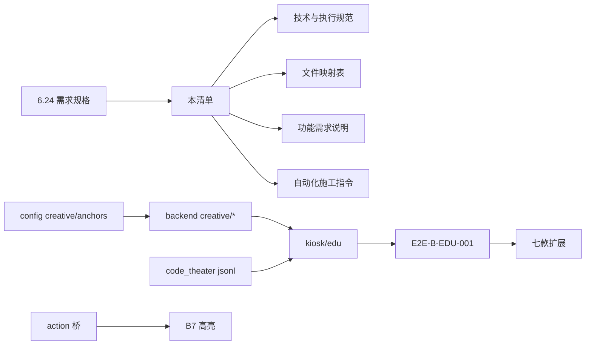

# 6.24 · B 链教育版整合任务清单 v1.0

> **起算日**：2026-06-24（需求评审通过）  
> **目标日**：2026-06-30（与 D10 展陈对齐）  
> **主规格**：[`6.24_B链教育版用户旅程与需求规格_v1.0.md`](./6.24_B链教育版用户旅程与需求规格_v1.0.md)  
> **并行主线**：[`6.23_七天交工工作清单_v1.0.md`](./6.23_七天交工工作清单_v1.0.md) D6–D7（Kiosk 11 宫格 · exe）  
> **执行规范**：[`6.24_技术与执行规范_v1.0.md`](./6.24_技术与执行规范_v1.0.md)  
> **Agent 手册**：[`6.24_自动化施工指令_v1.0.md`](./6.24_自动化施工指令_v1.0.md)

---

## 一、交付目标（说人话）

| 必须做到（6.24） | 与 6.23 关系 | 不必做到（首期） |
|------------------|--------------|------------------|
| **B 链教育版** B0–B7 可演示（至少 platformer 垂直切片） | 7 款 A 深 R2 **已完成** · 作运行时底座 | 7 款全部 B7 高亮同日上线 |
| 左代码工作区 + 右 Godot **双栏常驻** | 沿用 `workspace` 隔离 · `bootstrap` | 左侧真实可编辑 IDE |
| 完型填空 → preset 写 `game_config` | 复用 `config_builder` · `tuning_mapper` | 用户上传美术 |
| 代码剧场 + 试玩操作↔代码高亮 | 教育区差异化 | 实时 LLM 流式打字 |
| `/kiosk/edu` 或 `?mode=edu` 独立入口 | 旧 S0–S9 保留作 A 链/回退 | 废弃旧向导 |

---

## 二、进度总览（2026-06-24）

```
6.23 R2 精选 7 款          ██████████  ✅ 7/7
6.23 B 链隔离/bootstrap    ██████████  ✅ workspace_guard · release
6.23 Kiosk 线 A            ████████░░  🔄 7 宫格 · shortcut
6.23 Kiosk 线 B 旧向导     ██████░░░░  🔄 S8 generate · 无教育 UI
6.24 需求文档              ██████████  ✅ 评审通过
6.24 P0 platformer 切片    ██████████  ✅ 16/16 · E2E-B-EDU-001 · MCP PASS
6.24 P1 七款填空+剧场      ██████████  ✅ 窗7 集成 · validate 7/7
6.24 P1 六款 E2E+MCP       ██████████  ✅ 6/6 · E2E-B-EDU-BATCH · shmup+racing MCP PASS
6.24 P1-R 前端联调         ██████████  ✅ 窗9–13 · 12/12
6.23 D6 Kiosk 精选7联调    ░░░░░░░░░░  🔲 7 款 A 深 R2 · 非 11 L0
6.24 展陈 P0 edu/鲁棒性    █████████░  🔄 窗14–18 ✅ · 窗19 彩排
6.26 甲方 P3 UI/响应式      ░░░░░░░░░░  🔲 P3 开工 · 见 6.26 附录A
6.23 D7 Windows exe        ░░░░░░░░░░  🔲 P1（下调）
```

---

## 三、分期任务（P0 / P1 / P2）

### P0 · 垂直切片（6.24–6.25）— platformer preset-only

| ID | 模块 | 任务 | 产出路径 | 状态 |
|----|------|------|----------|------|
| P0-01 | 配置 | `kiosk_edu_spec.json` 初版 | `config/kiosk_edu_spec.json` | ✅ |
| P0-02 | 配置 | platformer 完型填空 schema | `config/creative_templates/platformer.json` | ✅ |
| P0-03 | 配置 | platformer 推荐名 | 合入 creative_templates 或 `_names` | ✅ |
| P0-04 | 配置 | platformer 代码锚点 | `config/code_anchors/platformer.json` | ✅ |
| P0-05 | 资产 | platformer 代码剧场 jsonl | `assets/code_theater/platformer.jsonl` | ✅ |
| P0-06 | 后端 | `POST /intent/match-genre` 关键词版 | `backend/app/routers/intent.py` | ✅ |
| P0-07 | 后端 | `GET /creative/templates/{genre}` | `backend/app/routers/creative.py` | ✅ |
| P0-08 | 后端 | `POST .../creative/answers` | `backend/app/services/creative/` | ✅ |
| P0-09 | 后端 | `POST .../analyze-requirements` preset-only | `creative/analyzer.py` | ✅ |
| P0-10 | 后端 | `POST .../generate/v2` | `backend/app/routers/generate.py` 扩展 | ✅ |
| P0-11 | 前端 | 双栏壳 B0–B6 | `kiosk/edu/` 或 `wizard_edu.js` | ✅ |
| P0-12 | 前端 | 代码剧场组件 | `kiosk/edu/code-theater.js` | ✅ |
| P0-13 | Godot | platformer action 上报 ≥2 | `templates/_edu/` 桥 + workspace 挂载（见 B7 规格） | ✅ |
| P0-14 | 前端 | B7 高亮 jump + stomp | `kiosk/edu/code-highlight.js` | ✅ |
| P0-15 | 验收 | E2E-B-EDU-001 | `05-工具脚本/e2e_b_edu_platformer.py` | ✅ |
| P0-16 | MCP | platformer workspace 无 ERROR | godot-mcp run_project | ✅ |

**2026-06-24 P0 闭环**：窗1–5 ✅ · E0–E16 自动化 PASS · **E17 人工签字 ✅** · 窗19 彩排待办

**2026-06-24 四窗并行进站**：窗1 配置 ✅ · 窗2 后端 ✅ · 窗3 前端壳 ✅ · 窗4 Godot 桥 ✅ · 窗5 E2E/MCP ✅ · **generate/v2 `_edu` 注入** ✅

**P0 过关**：讲解员可带一名儿童走完 B0→B7（platformer）· 左侧剧场流畅 · 跳跃/踩怪各触发 1 次高亮 · templates 未被写入。

**P0-06 ~ P0-10 API 示例（后端完成态）**

```http
POST /intent/match-genre
Content-Type: application/json

{"text":"我想玩马里奥闯关","session_id":"<uuid>"}
```

```json
{"matched_genre":"platformer","confidence":1.0,"reply_text":"听起来你想玩横版闯关！","candidates":[]}
```

```http
GET /creative/templates/platformer
```

```json
{"genre":"platformer","questions":[{"id":"q_move","widget":"single_choice"}]}
```

```http
POST /sessions/<uuid>/analyze-requirements
```

```json
{
  "resolutions":[{"question_id":"q_jump","resolution":"preset","tuning_path":"tuning.player.jump_velocity","value":-440}],
  "llm_patch_required":false,
  "code_map_preview":{"jump":{"file":"config/game_config.json","path":"tuning.player.jump_velocity","caption":"跳跃力度"}}
}
```

```http
POST /sessions/<uuid>/generate/v2
```

```json
{
  "ok":true,
  "workspace_path":"workspace/<uuid>",
  "config_path":"workspace/<uuid>/config/game_config.json",
  "code_map":{"jump":{"file":"config/game_config.json","line":12}},
  "genre":"platformer"
}
```

---

### P1 · 七款扩展（6.26–6.28）

| ID | 模块 | 任务 | 状态 |
|----|------|------|------|
| P1-01 | 配置 | 7 款 `creative_templates/{slug}.json` | ✅ |
| P1-02 | 配置 | 7 款 `code_anchors/{slug}.json` | ✅ |
| P1-03 | 资产 | 7 款 `code_theater/{slug}.jsonl` | ✅ |
| P1-04 | 配置 | `intent_genre_lexicon.json` 全品类 | ✅ |
| P1-05 | 前端 | B4 通用表单渲染器（填空/单选/滑块） | ✅ |
| P1-06 | 前端 | B2 七品类推荐名芯片 | ✅ |
| P1-07 | Godot | 7 款 `_edu` hooks 注册 `GENRE_HOOKS` | ✅ |
| P1-08 | 后端 | `POST .../play/action` 统一桥 | ✅ |
| P1-09 | 联调 | 与 6.23 D6 Kiosk 入口分流（A/B/edu） | ✅ |
| P1-10 | 文档 | 七款填空逐款校准记录 | `评审记录/6.24_creative_templates_校准.md` | ✅ |
| P1-11 | 验收 | E2E-B-EDU-BATCH 六款 | `05-工具脚本/e2e_b_edu_batch.py` | ✅ |
| P1-12 | MCP | shmup + racing workspace 无 ERROR | godot-mcp run_project | ✅ |

**2026-06-24 P1 窗8 闭环**：6/6 批量 E2E PASS · 评审 [`E2E-B-EDU-BATCH_六款.md`](./评审记录/E2E-B-EDU-BATCH_六款.md) · MCP shmup+racing `errors: []`

### P1-R · 前端与联调收工（窗9–13）

> **手册**：[`6.24_P1-R_前端与联调收工手册_v1.0.md`](./6.24_P1-R_前端与联调收工手册_v1.0.md) · **提示词**：[`6.24_P1-R_附录A`](./6.24_P1-R_附录A_完整窗口提示词_v1.0.md) · **快照**：[`快照/6.24_P1-R_开工前状态快照`](./快照/6.24_P1-R_开工前状态快照_v1.0.md)

| ID | 任务 | 窗 | 状态 |
|----|------|-----|------|
| P1-04 | intent 词表 + b1 接线 | 9 | ✅ 2026-06-24 |
| P1-05 | B4 通用表单 skill_pick | 10 | ✅ 2026-06-24 |
| P1-06 | B2 推荐名 API | 10 | ✅ 2026-06-24 |
| P1-08 | POST play/action | 11 | ✅ 2026-06-24 · pytest 4/4 |
| P1-09 | Kiosk A/B/edu 分流 | 12 | ✅ 2026-06-24 · Playwright 6/6 URL |
| — | 浏览器冒烟 + 12/12 签字 | 13 | ✅ 2026-06-24 · Playwright 7/7 |

---

### 展陈 P0 · 6.28–6.30（**2026-06-24 开工** · 窗14–19）

> **说明**：以下与 P1 12/12 独立 · 展陈硬门槛 · D7 exe 已下调至 **P1**  
> **总控**：[`6.24_展陈P0_总控对接与启动_v1.0.md`](./6.24_展陈P0_总控对接与启动_v1.0.md) · 提示词 [`附录A`](./6.24_展陈P0_附录A_完整窗口提示词_v1.0.md) · 约束 [`.cursor/rules/exhibition-p0.mdc`](../../.cursor/rules/exhibition-p0.mdc)

| ID | 任务 | 窗 | 目标日 | 状态 |
|----|------|-----|--------|------|
| E-P0-19 | 鲁棒性：启停复位 · release · templates 隔离审计 | 14 | 6/28–30 | ✅ 2026-06-24 |
| E-P0-17 | B6/B7 左侧加载 workspace 真 `game_config.json` | 15 | 6/28–29 | ✅ 2026-06-24 |
| E-P0-18 | B7 试玩展陈联调（Godot launch + 网页双栏，替代占位） | 16 | 6/28–29 | ✅ 2026-06-24 |
| D6 | Kiosk A 链 **精选 7 款**宫格联调（非 11 L0） | 17 | 6/28 | ✅ 2026-06-24 技术 · 彩排前补验 |
| E17 | platformer 实机 B7 跳/踩怪高亮 ≥120s | 18 | 6/28–30 | ✅ 2026-06-24 |
| 彩排 | A 链快玩 + B 链 edu demo | 19 | 6/30 | 🔲 |

**D6 七款 slug**：platformer · shmup · survivor · pingpong · fighting · parkour · racing

**E-P0-19 检查项**：`bootstrap` 清孤儿 workspace · 页关闭 `release`/sendBeacon · 「重新开始」复位 · `templates/{slug}/` 无写入 · 连续 3 用户无配置串台

### 展陈 P1（由原 P0 下调）

| ID | 任务 | 目标日 | 状态 |
|----|------|--------|------|
| D7 | Windows exe 导出（精选 3 款 preset） | 6/29+ | 🔲 |
| #12 | Redis 30min soak | 展前 | 🔲 |
| #18–20 | 讲解员手册 · Gate · 部署 | 6/29–30 | 🔲 |

---

### P2 · 智能增强（6.28+ · 可砍至展后）

| ID | 模块 | 任务 | 状态 |
|----|------|------|------|
| P2-01 | NLU | LLM 辅助 `match-genre` 低置信追问 | 🔲 |
| P2-02 | 分析 | `llm_patch` 白名单 + 超时降级 | 🔲 |
| P2-03 | 外部 | OpenAI 兼容 API 接入 | 🔲 |
| P2-04 | 外部 | Cursor Agent API（可选） | 🔲 |
| P2-05 | 语音 | B1 语音输入（二期） | 🔲 |

---

## 四、按日日程（与 6.23 并行）

### D-624 · 2026-06-24（今天）

- [x] 6.24 用户旅程与需求规格 v1.0
- [x] 6.24 评审通过
- [x] 补齐 6.24 执行文档套件（本清单 · 技术规范 · 文件映射 · 功能说明 · 自动化指令）
- [x] P0-01 `kiosk_edu_spec.json` 骨架
- [x] P0-02 `creative_templates/platformer.json` 草案

### D-625 · 2026-06-25

- [ ] P0-06–P0-10 后端 API 最小集
- [x] P0-11 双栏 UI 壳（B0–B3）
- [ ] P0-04–P0-05 锚点 + 剧场素材（platformer）

### D-626 · 2026-06-26

- [ ] P0-11–P0-14 前端 B4–B7 串联
- [x] P0-15 E2E-B-EDU-001
- [x] P1-11 E2E-B-EDU-BATCH 六款
- [x] P1-12 MCP shmup + racing workspace
- [ ] **并行**：6.23 D6 Kiosk 11 宫格联调

### D-627 · 2026-06-27

- [x] P1-01~03 七款 creative · anchors · theater（窗1–6）
- [x] P1-07 GENRE_HOOKS 7/7（窗7）
- [x] P1-10 校准记录 · P1-11 BATCH E2E · P1-12 MCP
- [x] P1-04~06 前端 B4/B2 通用化 · 推荐名芯片（窗9–10）
- [x] P1-08 `play/action` · P1-09 Kiosk 分流（窗11–12）
- [x] 浏览器冒烟七款 Playwright 7/7（窗13）
- [ ] **并行**：6.23 D6 收尾

### D-628 · 2026-06-28

- [x] P1 全量 12/12 签字（窗13 收工）
- [ ] D6 精选 7 款宫格 · E-P0-17~19 · E17
- [ ] **并行**：6.23 D6 收尾

### D-629 · 2026-06-29

- [ ] 展陈彩排 checklist
- [ ] **P1**：D7 Windows exe（下调）

### D-630 · 2026-06-30

- [ ] 展陈彩排：A 链快玩 + B 链教育 demo（platformer 必演 · 建议 +1 款非 platformer）
- [ ] E17 platformer 人工展厅签字 · 现场支持预留

---

## 五、依赖关系



**硬依赖**

1. `creative_templates` 必须先对照 `templates/{slug}/config/game_config.json` 真实 tuning 路径校准（见 [`6.24_文件映射表_v1.0.md`](./6.24_文件映射表_v1.0.md)）。
2. `code_anchors` 与 `code_theater` **同源**，禁止两套口径。
3. `generate/v2` 必须走 `workspace_guard` · 禁止写 `templates/`。

---

## 六、按品类任务卡（P1 勾选）

> **说明**：配置三联表与 hooks 已于窗1–7 落盘；B7「浏览器高亮」依赖 P1-05/09，E2E 已验 edu 桥注入。

| slug | creative_template | code_theater | code_anchors | B7 actions | 状态 |
|------|-------------------|--------------|--------------|------------|------|
| platformer | ✅ P0 | ✅ P0 | ✅ P0 | ✅ P0（E2E + 浏览器 + E17 人工） | ✅ P1 |
| shmup | ✅ P1 | ✅ P1 | ✅ P1 | ✅ hooks+E2E+浏览器 | ✅ P1 |
| survivor | ✅ P1 | ✅ P1 | ✅ P1 | ✅ hooks+E2E+浏览器 | ✅ P1 |
| pingpong | ✅ P1 | ✅ P1 | ✅ P1 | ✅ hooks+E2E+浏览器 | ✅ P1 |
| fighting | ✅ P1 | ✅ P1 | ✅ P1 | ✅ hooks+E2E+浏览器（无 skill） | ✅ P1 |
| parkour | ✅ P1 | ✅ P1 | ✅ P1 | ✅ hooks+E2E+浏览器 | ✅ P1 |
| racing | ✅ P1 | ✅ P1 | ✅ P1 | ✅ hooks+E2E+MCP+浏览器 | ✅ P1 |

---

## 七、风险与砍 scope 顺序

| 优先级 | 可砍 | 不可砍 |
|--------|------|--------|
| 1 | P2 LLM / Cursor API | P0 platformer 端到端 |
| 2 | P1 七款同日全 B7 | workspace 隔离 · bootstrap |
| 3 | 语音输入 · 打字音效 | 双栏布局 · 代码剧场 |
| 4 | 某款第 4、5 道填空题 | 每款 ≥3 题 · preset 写 tuning |
| 5 | llm_patch 任意文件 | A 链 7 宫格快玩（6.23 D6） |

---

## 八、每日收工（强制）

1. 勾选本节「按日日程」
2. 更新 [`工作状态记录_v1.0.md`](./工作状态记录_v1.0.md) §6.24 小节
3. 若改 API：同步 [`6.24_文件映射表_v1.0.md`](./6.24_文件映射表_v1.0.md)
4. MCP `run_project` 无 ERROR 再标 ✅

---

## 九、相关路径

| 用途 | 路径 |
|------|------|
| 需求规格 | `开发文档/模板引擎/6.24_B链教育版用户旅程与需求规格_v1.0.md` |
| 技术规范 | `开发文档/模板引擎/6.24_技术与执行规范_v1.0.md` |
| 文件映射 | `开发文档/模板引擎/6.24_文件映射表_v1.0.md` |
| 功能说明索引 | `开发文档/模板引擎/6.24_功能需求说明_索引_v1.0.md` |
| Agent 指令 | `开发文档/模板引擎/6.24_自动化施工指令_v1.0.md` |
| 窗8 自查 | `开发文档/模板引擎/评审记录/6.24_P1_窗8_施工自查总结.md` |
| P1-R 收工 | `开发文档/模板引擎/6.24_P1-R_前端与联调收工手册_v1.0.md` |
| P1-R 窗13 验收 | `开发文档/模板引擎/评审记录/E2E-B-EDU-P1-R_收工.md` |
| P1-R 提示词 | `开发文档/模板引擎/6.24_P1-R_附录A_完整窗口提示词_v1.0.md` |
| 旧 B 链 | `kiosk/wizard.js` · `POST /generate` |
| 隔离实现 | `backend/app/services/workspace_guard.py` |

---

*v1.8 · 2026-06-26 · 窗18 E17 ✅ · GitHub v1.0 · **6.26 甲方 P3 开工***
