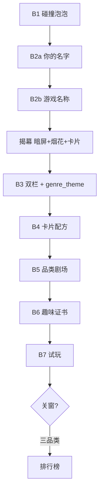

# 7.4 · P4-C UI 美化 · 需求规格 v1.1

> **起算**：2026-07-04  
> **甲方细则录入**：2026-07-04  
> **v1.1**：细化 B2 子状态机 · 动效时序 · API · 验收分项  
> **主规格**：[`7.4_展厅正式落地_需求规格_v1.0.md`](./7.4_展厅正式落地_需求规格_v1.0.md)  
> **基线**：v1.1 蓝白 UI · RECIPE 配方+证书 · B0–B7 旅程不变

---

## 一、产品一句话

在保留 B 链「意图→配方→制作→试玩」骨架的前提下，把创作过程做成**分品类沉浸式儿童体验**：问名字、揭幕烟花、卡片式配方、趣味代码剧场、个性证书与排行榜，首页意图选择改为**碰撞泡泡**。

---

## 二、甲方七项需求映射

| # | 甲方原话摘要 | ID | 主要步骤 | 施工窗 | 状态 |
|---|-------------|-----|----------|--------|------|
| 1 | 填空环节新增「你的名字是？」 | **UI-C01** | B2 两屏子流程 | C-2 | 🔲 |
| 2 | 暗屏→揭幕卡+烟花→亮屏；此后分品类 UI | **UI-C02** | B2→B3 · 主题 | C-3 · C-8 | 🔲 |
| 3 | 完型填空卡片式+动画+进度条 | **UI-C03** | B4 | C-4 | 🔲 |
| 4 | 伪代码生成品类趣味 UI | **UI-C04** | B5 | C-5 | 🔲 |
| 5 | 证书标题趣味化 + GIF 下载 | **UI-C05** | B6/B7 | C-6 | 🔲 |
| 6 | 三品类排行榜（关窗后） | **UI-C06** | B7 · API | C-7 | 🔲 |
| 7 | B1 白椭圆→碰撞泡泡 | **UI-C07** | B1 | C-1 | ✅ |

**排行榜品类**：`platformer` · `shmup` · `survivor`  
**映射细节**：[`7.4_P4-C_七款主题与动效映射表_v1.0.md`](./7.4_P4-C_七款主题与动效映射表_v1.0.md) §五

---

## 三、旅程变更（相对 v1.1）

### 3.1 流程图

### 3.2 逐步对照

| 步骤 | v1.1 | 7.4 P4-C |
|------|------|----------|
| B1 | 白椭圆 `.chip` | Canvas 碰撞泡泡 · 见 UI-C07 |
| B2 | 单屏 `display_name` | **两屏**：`creator_name` → `display_name` |
| B2→B3 | `stepIndex++` 直切 | `ForgeReveal.play()` **await** 后再进 B3 |
| B3–B7 视觉 | 全局蓝白 | `body[data-genre-theme]` 七套 token |
| B4 | `.creative-form-panel` 列表 | `.b4-card-flow` 逐卡 + 进度条 |
| B5 | 统一 `code-theater` | + `theater-overlays/{slug}` |
| B6 证书 | 固定 `certificate.title` | `title_template` + GIF 钮 |
| B7 结束 | 无 | `play/status` 关窗 → 排行榜（3 款） |

### 3.3 B2 子状态（不增 STEPS 枚举）

见 [`7.4_P4-C_技术与执行规范_v1.0.md`](./7.4_P4-C_技术与执行规范_v1.0.md) §二 · `b2SubStep: creator | gameName | done`

---

## 四、范围

### 在范围

| 层 | 路径 |
|----|------|
| Kiosk | `kiosk/edu/**` 见 [`7.4_文件映射表_v1.0.md`](./7.4_文件映射表_v1.0.md) §三 |
| 配置 | `kiosk_edu_spec` → `genre_themes` · `forge_reveal` · `certificate` · `leaderboard` |
| 后端 | `creator_name` · `leaderboard` router |
| `_edu` hooks | 仅 3 款 `run_complete` 记分 |

### 不在范围

- `creative_templates` 题面/tuning · `core/**` · 跨馆云榜 · LLM

### RECIPE 边界

| 可改 | 不可改 |
|------|--------|
| 证书标题/动效/GIF · B4 卡片 UI · B2 新字段 | `buildRecipeRows` · 问卷 prompt/options/tuning_path |

---

## 五、分期派窗

| 窗 | UI-C | 依赖 | 并行 |
|----|------|------|------|
| C-1 | C07 | — | ↔ C-2 |
| C-2 | C01 | — | ↔ C-1 |
| C-3 | C02 | C-2 | — |
| C-4 | C03 | C-3 | — |
| C-5 | C04 | C-3 | ↔ C-7 |
| C-6 | C05 | C-2 | — |
| C-7 | C06 | B7 launch | ↔ C-5 |
| C-8 | C02 补齐 | C-1~7 | — |

详表：[`7.4_P4-C_施工backlog_v1.0.md`](./7.4_P4-C_施工backlog_v1.0.md)

---

## 六、验收总表（分项）

### UI-C01 名字

- [ ] B2 第一屏「你的名字是？」· 1–8 字校验
- [ ] 第二屏游戏名仍可用 · 顺序不可跳过
- [ ] `creator_name` 写入 session API

### UI-C02 揭幕+主题

- [ ] 卡片文案「开始制作{creator}的{game}游戏！」
- [ ] 暗屏→烟花→亮屏总时长 2–3s
- [ ] B3 起 `data-genre-theme` 与所选 genre 一致
- [ ] 七款主题 token 在映射表 §一 齐备

### UI-C03 B4 卡片

- [ ] 一次一题 · 进度 `n/total` · 过渡动画流畅
- [ ] 每款 ≥1 题面 widget（映射表 §二）
- [ ] `submitAnswers` 仍成功 · batch E2E 不回归

### UI-C04 B5 剧场

- [ ] 七款 overlay 在 B5 可见且不挡代码
- [ ] `prefers-reduced-motion` 可关闭 overlay 动画

### UI-C05 证书

- [ ] 标题含 creator + display_name
- [ ] GIF 或约定降级 PNG 可下载
- [ ] 配方摘要表行 ≥3 · 打印预览正常

### UI-C06 排行榜

- [ ] platformer/shmup/survivor 关窗后弹层
- [ ] Top10 展示 · 本次记录高亮
- [ ] 其他品类不弹

### UI-C07 泡泡

- [x] 7 泡泡运动碰撞 · tap 填 intent
- [x] 1920×1080 触控命中 ≥48px（半径 44–46px · 静态网格 min-height 52px）
- [x] 系统触控键盘 + 中文拼音（TabTip API · 2026-07-05 验收）
- [x] emoji 奖章 + 竖屏底栏（2026-07-05 验收）
- [ ] 60fps 目视流畅 · 展前可选录屏

### 通用

- [ ] `git diff creative_templates/` 为空
- [ ] `git diff templates/*/core/` 为空
- [ ] `e2e_recipe_a_certificate.py` PASS（更新后）

---

## 七、文档配套

| 文档 | 用途 |
|------|------|
| [`7.4_P4-C_UI美化_功能需求说明_v1.0.md`](./7.4_P4-C_UI美化_功能需求说明_v1.0.md) | 模块 FRS |
| [`7.4_P4-C_七款主题与动效映射表_v1.0.md`](./7.4_P4-C_七款主题与动效映射表_v1.0.md) | 主题·widget·剧场 |
| [`7.4_P4-C_技术与执行规范_v1.0.md`](./7.4_P4-C_技术与执行规范_v1.0.md) | API·时序·加载顺序 |
| [`7.4_P4-C_施工backlog_v1.0.md`](./7.4_P4-C_施工backlog_v1.0.md) | 子窗完成定义 |
| [`7.4_附录A_完整窗口提示词_v1.0.md`](./7.4_附录A_完整窗口提示词_v1.0.md) | 施工单 |

---

*v1.1 · 2026-07-04 · 细化版*
