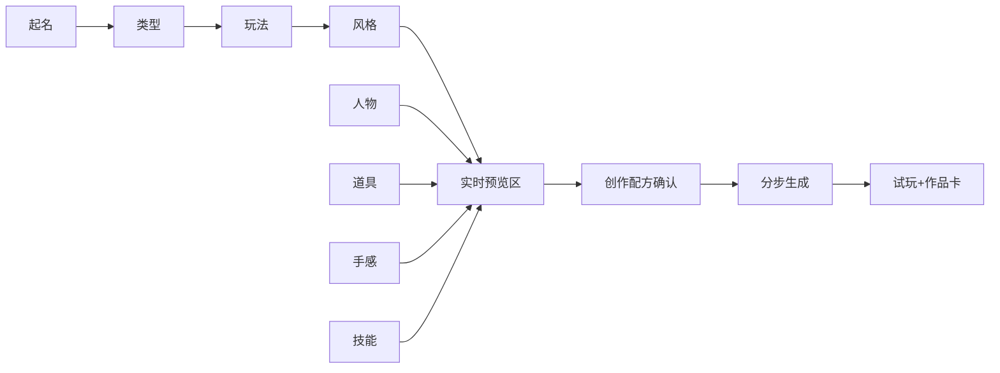

# AI 创作引导流程 v1.1

> **版本**：v1.1 · 2026-06-20（基于 B站/知乎/CSDN/Scratch/GameCreator 与客制化感知调研优化）  
> **对齐**：Session 六态 · [`品类核心参数规格_v1.0.md`](./品类核心参数规格_v1.0.md)  
> **目标**：K12 在 **≤10 分钟**内完成创作，并 **强烈感知「这是我的游戏」**  
> **档位**：L0 可跳过 AI；**L1/L2 走本流程**

---

## 〇、客制化感知设计原则（调研结论）

> 来源：Survey-02 · 知乎少儿编程/Scratch · B站 Scratch/GameCreator 教程 · Extra Credits「选择的illusion」· Octalysis Poison/Plant Picker

| 原则 | 做法 | 反例 |
|------|------|------|
| **即时可见** | 每步选择后 **3 秒内** 更新右侧「我的小游戏」预览 | 选完一堆才第一次看图 |
| **身份锚点** | 早期让用户 **命名** 游戏与角色（「这是我的 XX」） | 只有系统默认名 |
| **选择清单** | 顶部 **创作进度 0/8**，每步 +1，完成有轻反馈 | 黑盒进度条 |
| **配方复盘** | S8 前 **「你的创作配方」** 一页汇总全部选择 | 用户忘记自己选了啥 |
| **对比确认** | S8 展示 **默认 demo vs 你的版本** 缩略对比 | 看不出 AI 改了什么 |
| **Plant + Poison** | **Plant**：品类/难度/技能（真影响玩法）；**Poison**：配色形容词、台词（表达个性） | 全假或全真 |
| **仪式收尾** | S8 完成播放 **「诞生动画」** + 音效；S9 首屏显示 **作品名** | 静默进入游戏 |
| **社交证据** | S9 后可选 **作品卡**（名+截图+二维码） | 无法炫耀 |

**核心公式**：客制化感知 ≈ **（可见选择次数 × 即时反馈）+ 命名所有权 + 复盘确认 + 试玩可验证**

---

## 一、流程总览（v1.1 · 10 步 + 3 个感知增强点）

| 步 | 屏幕文案 | 用户操作 | 客制化增强 | 耗时 |
|----|----------|----------|------------|------|
| **S0** | 欢迎 + **给你的游戏起个名字** | 输入/选推荐名 | ★ 身份锚点 `meta.display_name` | 45s |
| **S1** | 选择游戏类型 | 11 类选 1 | 选中后 **3s 预览** 该品类 demo 动图 | 45s |
| **S2** | 你想怎么玩？ | 玩法子模式 | 选项带 **一句话感受** + 跳转说明 | 30s |
| **S3** | 选择风格 | 风格卡片 | **实时换预览** 背景+UI 色 | 30s |
| **S4** | 创建人物 | 点选 / AI 描述 | **立绘立即出现在预览区** | 60s |
| **S5** | 创建道具 | 2–4 槽位 | 道具 **挂到角色预览** 上 | 45s |
| **S6** | 动作手感 | 难度卡片 | 预览里 **速度线/子弹密度** 示意 | 30s |
| **S7** | 小技能 | 最多 2 个 | 技能图标 **点亮** + 一句效果 | 30s |
| **★R** | **你的创作配方** | 确认/返回修改 | **8 项清单 + 缩略图** | 30s |
| **S8** | AI 正在制作 | 观看 | **按你的选择分步文案**（非泛化 loading） | 3–4min |
| **S9** | 试玩 | 玩 | **标题屏显示作品名** + 可选作品卡 | 2–3min |

**合计**：引导 ~**5.5 min** + 生成 **3–4 min** + 试玩 **2–3 min**



---

## 二、界面布局（固定）

```text
┌─────────────────────────────────────────┐
│  创作进度 ●●●●○○○○  4/8    [作品名：星际小卫士] │
├──────────────────┬──────────────────────┤
│  左侧：当前步骤    │  右侧：我的小游戏预览   │
│  （大按钮/卡片）   │  （随 S1–S7 实时更新）  │
└──────────────────┴──────────────────────┘
```

参考：Scratch「舞台区即时看到角色变化」；GameCreator「像编辑文档一样即时看到成品」。

---

## 三、逐步说明（v1.1）

### S0 · 欢迎 + 命名（新增重点）

**文案**：

> 欢迎来到 AI 小游戏创作工坊！  
> 先给你的游戏 **起个名字** 吧——这是 **你的** 作品。

- 提供 **3 个推荐名**（可点选）+ 短输入框（≤8 字，敏感词过滤）
- 写入 `meta.display_name`；S9 标题屏、作品卡、QR 页 **全程使用此名**
- **调研依据**：命名 = 所有权锚点（Scratch 作品署名；Survey-02「这是我做的」）

---

### S1 · 选择游戏类型

- 11 宫格 + **每类 5 秒循环动图**（非静态图标）
- 选中后右侧预览 **立即切换** 到该品类默认场景
- 进度点 +1；轻音效「叮」

---

### S2 · 你想怎么玩？

- 每选项 = **图标 + 感受句**（如「越变越强 · 打败敌人会升级」）
- 若跳转品类：动画 ** morph 预览** 到新模板 + 文案「已为你切换到最适合的模式！」
- 见 [`play_variants.json`](../../config/play_variants.json)

**调研依据**：Extra Credits — 短分支后汇合；用户要 **感受被理解**，不一定要真融合 core。

---

### S3 · 选择风格

| 风格 | 预览变化 |
|------|----------|
| 太空 | 深蓝底 + 星星粒子 |
| 森林 | 绿底 + 树叶装饰 |
| 厨房 | 暖黄 + 格子 UI |
| 像素 / 糖果 | 滤镜 + 边框 |

- 可选 **1 个形容词**（「可爱」「酷」）→ `theme.mood_keywords`（Poison Picker，增强表达）

---

### S4 · 创建人物

| 路径 | 体验 |
|------|------|
| **素材库** | 横向滑动 **3–6 角色**，点选 **立即替换** 预览区主角 |
| **AI 描述** | 输入框 + 示例 chips（「蓝色机器人」「粉色猫咪飞行员」）→ 先 **占位剪影**，生图完成后 **淡入替换** |

- 写入 `theme.character`
- **禁止**这一步只写 config 不出图——用户必须 **看见** 角色变了

---

### S5 · 创建道具

- 按品类展示槽位（武器/伙伴/塔/食材…）
- 每选一项 **挂到预览区角色旁**（Scratch「添加造型」即时可见）
- 最多每槽 1 个；可跳过（默认道具）

---

### S6 · 动作手感

**卡片化（禁止暴露数值）**：

| 卡片 | 文案 | 预览示意 |
|------|------|----------|
| 🌱 轻松 | 「慢慢玩，不着急」 | 敌人少、速度慢 |
| ⚖️ 刚好 | 「大多数人选这个」 | 默认 |
| 🔥 挑战 | 「手速要快哦！」 | 敌人多、速度快 |

- 底部 **可选一句**（「再快一点」「子弹多一点」）→ `tuning_mapper`
- 选中时预览 **播放 2 秒微动画**（速度线/弹幕密度变化）

---

### S7 · 小技能

- 最多 **2 个**；卡片含 **图标 + 10 字效果**
- 选中卡片 **发光边框**；预览区角色旁 **出现技能图标**
- 写入 `tuning.enabled_skills`

**调研依据**：小码王式「选技能=宠物成长」— 轻量 Plant Picker，用户记得住。

---

### ★R · 创作配方确认（v1.1 新增）

S8 之前 **强制一页复盘**：

```text
✨ 你的创作配方 · 《星际小卫士》
────────────────────────
游戏类型    射击 · 打怪闯关
风格        太空
主角        蓝色机器人（或 AI 生成图缩略图）
道具        激光剑、能量盾
手感        挑战模式
技能        冲刺、护盾
────────────────────────
[ 返回修改 ]     [ 开始制作！ ]
```

- **调研依据**：知乎/Scratch 课堂「秀作品」前需要 **回顾自己做了什么**；减少「AI 代劳」感
- 事件：`wizard_recap_confirm`

---

### S8 · AI 正在制作（分步文案 · 绑定用户选择）

**禁止**只显示「加载中…」。按 **用户配方逐步 tick**：

| 进度 | 屏幕文案（示例） |
|------|------------------|
| 10% | 正在搭建 **《{display_name}》** 的世界… |
| 25% | 换上你选的 **{style}** 风格… |
| 40% | 主角 **{character_name}** 登场… |
| 55% | 装备 **{prop_list}** … |
| 70% | 按 **{difficulty}** 调整手感… |
| 85% | 激活技能：**{skills}** … |
| 100% | **诞生完成！**（短动画 + 音效） |

- 右侧可选 **左：默认 demo / 右：你的版本** 静态对比图（S8 结束前 5s 闪现）
- 后台：复制模板 → Agent 改 config → MCP run；逻辑同 v1.0

---

### S9 · 试玩 + 作品感

- 游戏 **标题屏** 显示 `meta.display_name` + 主角立绘
- 试玩 2–3 min
- 结束弹出 **作品卡**：名 + 截图 + 「我做出了这款游戏！」+ 可选 QR
- 研学场景：作品卡可 **批量上墙**

---

## 四、客制化感知 vs 真实改动（对内）

| 用户感知 | 实际改动层 | 类型 |
|----------|------------|------|
| 起名、风格、角色、道具 | theme | Poison + 部分 Plant |
| 玩法子模式 | meta + preset/跳转 | **Plant** |
| 难度、技能 | tuning | **Plant** |
| 融合两种品类 | — | **不做**；用 S2 跳转替代 |

---

## 五、L0 / L1 / L2

| 档位 | 流程 |
|------|------|
| **L0** | S0 可简化 · S1 选类 → 直接 S9（仍显示默认名） |
| **L1** | **S0–R–S8–S9 全走** |
| **L2** | L1 + 开放 NL 补充 + 作品卡 QR 必出 |

---

## 六、调研参考来源

| 来源 | 启示 |
|------|------|
| Scratch 教学（B站 BV1KZ421H7fh 等） | 添加角色/造型 **立即舞台可见** |
| 知乎 · AI Scratch / 少儿编程选型 | 上传图片、自由搭配 → **个人特色** |
| 知乎 · 小码王 PBL / WaiWaiBot | 命名、游戏化技能、**可展示成果** |
| GameCreator（B站） | **像编辑文档** 一样看到成品 |
| Extra Credits · Illusion of Choice | 有限选择 + **即时反馈** ≈ 真自由 |
| Yu-kai Chou · Plant/Poison Picker | 大选择真影响；小选择重表达 |
| Survey-02 POV | 「这是我做的」· 透明非黑盒 · 10min 短循环 |

---

## 七、相关配置

| 文件 | 用途 |
|------|------|
| `config/genre_registry.json` | 11 品类 |
| `config/play_variants.json` | S2 子模式 |
| `config/optional_skills.json` | S7 技能 |
| `assets/kenney/README.md` | Kenney 素材说明 |
| `backend/wizard.py` | 步骤 + 预览 API（D2） |

---

*v1.1 · 2026-06-20 · 客制化感知优化*
