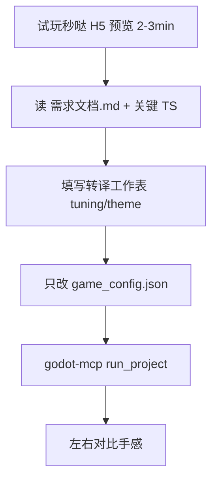

# 秒哒 H5 → Godot `game_config.json` 转译指导手册 v1.0

> **更新**：2026-06-23  
> **适用范围**：秒哒精选 7 项（成熟 H5 原型 → Godot L0 手感对齐）  
> **注册表**：[`config/miaoda_reference_registry.json`](../../config/miaoda_reference_registry.json)  
> **落盘源码**：[`03-背景与调研/data/秒哒精选源码/`](../../03-背景与调研/data/秒哒精选源码/)  
> **工作表模板**：[`03-背景与调研/config/miaoda_translation_worksheet.template.json`](../../03-背景与调研/config/miaoda_translation_worksheet.template.json)

---

## 一、原则：设计提取，非代码移植

对齐 [`秒哒竞品调研整合_v1.0.md`](../../03-背景与调研/秒哒竞品调研整合_v1.0.md) §5.3、§九：

| 做 | 不做 |
|----|------|
| 试玩秒哒 H5，记录手感与 UX | 复制 React / Phaser 组件到 Godot |
| 读 `docs/需求文档.md` + `constants.ts` / `MainGame.ts` | 修改 `templates/{slug}/core/` |
| 只改 `config/game_config.json` 的 `tuning` / `theme` / `enabled_skills` | 引入 Supabase、联机、存档 |
| theme 贴图走 Kenney + `assets/theme_paths.json` | 依赖秒哒沙箱内上传的二进制图/音 |

**API 重建限制**：`miaoda_download_sources.py` 从 trajectory 还原的 `src/` **可能缺图缺音**；转译时以数值与 UX 描述为准，素材一律用 Kenney CC0。

---

## 二、双轨角色

```text
秒哒 H5  = UX / 手感标杆（快速迭代、浏览器预览）
Godot L0 = 生产交付（Kiosk、Windows exe、展厅稳定）
```

好手感路径：秒哒试玩 → 填写转译工作表 → 补丁 `game_config.json` → `godot-mcp run_project` → 左右对比。

**单次会话约束**（[`.cursor/rules/godot-mini-game.mdc`](../../.cursor/rules/godot-mini-game.mdc)）：只改 **一个** `templates/{slug}/` 目录。

---

## 三、转译流水线



### 步骤说明

1. **试玩**：打开 `miaoda_reference_registry.json` 中对应 `preview_url`，记录移动/跳跃/难度主观感受。
2. **读档**：`秒哒精选源码/{slug}/docs/需求文档.md`；`file_index.json` 的 `key_files`（常见 `constants.ts`、`MainGame.ts`）。
3. **填表**：复制 worksheet 模板为 `{slug}_worksheet.json`，填写 `tuning_candidates` / `theme_candidates` / `ux_notes`。
4. **改 config**：仅编辑 `templates/{slug}/config/game_config.json`；数值对照 [`品类核心参数规格_v1.0.md`](./品类核心参数规格_v1.0.md)。
5. **验证**：`godot-mcp run_project` 无 ERROR；可选 `POST /generate` + `e2e_b001_platformer.py` 模式（platformer 已通）。
6. **对比**：同操作下左右试玩，微调至 ±30% 范围内。

### 建议转译顺序

`platformer` → `survivor` → `racing` → `fighting` → `pingpong` → `shmup` → `parkour`

---

## 四、±30% clamp 规则

- 基准：`templates/{slug}/config/game_config.json` 当前默认值（或 `config/tuning_feel_overrides.json` 的 `base_ref`）。
- 任意 `tuning` 标量调整后，相对基准不得超出 **±30%**。
- `feel_id`（easy/balanced/challenge）合并逻辑见 `config/tuning_feel_overrides.json`；线 B MVP 以 platformer 为准，其余品类 D8 扩展。
- Schema 校验：`templates/_schema/game_config.schema.json`。

---

## 五、按品类提取清单

> **秒哒侧**：在 `src/game/constants.ts`、`MainGame.ts`、`gameStore.ts` 中搜 `SPEED`、`GRAVITY`、`DAMAGE`、`INTERVAL` 等常量。  
> **Godot 侧**：写入 `game_config.json` 对应 `tuning` 路径。

### platformer（横版闯关游戏）

| 秒哒 / PRD 概念 | Godot `tuning` 字段 |
|-----------------|---------------------|
| 移动速度 | `player.move_speed` |
| 跳跃初速度 | `player.jump_velocity` |
| 重力 | `physics.gravity` |
| 敌人巡逻速度 | `enemy.patrol_speed` |
| 收集目标数 | `collectible.target_count` |
| 关卡场景 | `level.scene`（一般不改） |

**theme**：`title`、`player_sprite`、`enemy_sprite`、`collectible_sprite`、`platform_sprite`、`background_sprite`

### survivor（割草生存 v6）

| 秒哒 / PRD 概念 | Godot `tuning` 字段 |
|-----------------|---------------------|
| 局时时长 | `session.duration_sec` |
| 玩家移速 | `player.speed` |
| 武器伤害/间隔 | `weapon.base_damage` · `weapon.interval_ms` |
| 敌人生成率 | `spawn.rate_per_sec` |
| 敌人数上限 | `spawn.max_alive` |
| 经验宝石吸附 | `xp.magnet_range` |

**theme**：糖果/卡通配色 → `theme.asset_pack` + Kenney `food-kit` / `tiny-dungeon`

### racing（欢乐赛车 v3）

| 秒哒 / PRD 概念 | Godot `tuning` 字段 |
|-----------------|---------------------|
| 最高速 | `car.max_speed` |
| 加速度 | `car.acceleration` |
| 转向率 | `car.turn_rate` |
| 障碍密度 | `obstacle.density` |
| 单局时长 | `round.duration_sec` |

**theme**：`player_sprite`（车辆）、`road_sprite`、`obstacle_sprite` → `racing-pack`

### fighting（街机格斗 v3）

| 秒哒 / PRD 概念 | Godot `tuning` 字段 |
|-----------------|---------------------|
| _walk / 血量 | `player.walk_speed` · `player.max_hp` |
| 轻拳 startup/active | `move.light.startup_frames` · `active_frames` |
| 伤害/硬直 | `move.light.damage` · `hitstun_frames` |
| AI 反应间隔 | `ai.reaction_interval_sec` |

**theme**：角色贴图 → `platformer-art-deluxe` 或 `abstract-platformer`

### pingpong（乒乓球 v4）

| 秒哒 / PRD 概念 | Godot `tuning` 字段 |
|-----------------|---------------------|
| 球速 | `ball.base_speed` · `ball.max_speed` |
| 球拍速度 | `paddle.speed` |
| AI 反应 | `ai.reaction_ms` |
| 获胜分数 | `rules.points_to_win` |

**theme**：`sports-pack` 球拍/网球/场地

### shmup（街机飞机 v2）

| 秒哒 / PRD 概念 | Godot `tuning` 字段 |
|-----------------|---------------------|
| 机体移速 | `player.speed` |
| 射速 | `player.bullet_interval_ms` |
| 敌弹密度 | `wave.enemy_count` · `spawn.interval_ms` |
| 通关波次 | `wave.target_waves` |

**theme**：`space-shooter-redux` 机体/激光/背景色

### parkour（跑酷）

| 秒哒 / PRD 概念 | Godot `tuning` 字段 |
|-----------------|---------------------|
| 奔跑速度 | `runner.speed` |
| 跳跃 | `jump.velocity` |
| 障碍密度/间距 | `obstacle.density` · `obstacle.min_gap_px` |
| 单局时长 | `round.duration_sec` |

**theme**：`jumper-pack` 草地/尖刺；`background_color`

---

## 六、workspace 验证路径

| 场景 | 命令/接口 |
|------|-----------|
| 本地 Godot | godot-mcp `run_project` · `templates/{slug}/` |
| 个性化链路（platformer） | `POST /sessions/{id}/generate` → `workspace/{id}/config/game_config.json` |
| 自动化 E2E | `python 05-工具脚本/e2e_b001_platformer.py` |
| 验收配置 | `config/l1_e2e_acceptance.json`（其余 6 类可扩展条目） |

---

## 七、禁止项

- 编辑 `core/` 或 `repo` 根 `core/`
- 复制秒哒 `src/` 到 Godot 工程
- 新建联机、存档、内购、广告
- 单次会话改多个 `templates/{slug}/`
- `tuning` 数值越界（>±30%）

---

## 八、附录 · 精选 7 项 appId / 预览 URL

来源：`config/miaoda_reference_registry.json`（2026-06-23 list-apps 匹配）

| slug | 秒哒项目名 | appId | 预览 URL |
|------|------------|-------|----------|
| platformer | 横版闯关游戏 | `app-chu2c3e6u4g1` | https://app-chu2c3e6u4g1.appmiaoda.com |
| survivor | 割草生存类游戏 | `app-cikthp6wjz0h` | https://app-cikthp6wjz0h.appmiaoda.com |
| racing | K12竞速小游戏 | `app-cikgdwwv35z5` | https://app-cikgdwwv35z5.appmiaoda.com |
| fighting | K12横版格斗游戏 | `app-cijahlqb7pj5` | https://app-cijahlqb7pj5.appmiaoda.com |
| pingpong | 乒乓球小游戏开发 | `app-cika5uyinqip` | https://app-cika5uyinqip.appmiaoda.com |
| shmup | 街机飞机射击游戏 | `app-chu7pw7h454x` | https://app-chu7pw7h454x.appmiaoda.com |
| parkour | K12跑酷小游戏 | `app-cijx9ysx61vl` | https://app-cijx9ysx61vl.appmiaoda.com |

**落盘路径**：`03-背景与调研/data/秒哒精选源码/{slug}/`（含 `manifest.json`、`file_index.json`、`docs/需求文档.md`、`src/`）

**下载命令**：

```powershell
python 05-工具脚本/miaoda_download_sources.py --resolve-only
python 05-工具脚本/miaoda_download_sources.py --slug platformer
python 05-工具脚本/miaoda_download_sources.py --all
```

**一键转译命令**（本地落盘 → `game_config.json`）：

```powershell
python 05-工具脚本/miaoda_apply_translation.py --all --dry-run
python 05-工具脚本/miaoda_apply_translation.py --all --backup --verify
python 05-工具脚本/miaoda_apply_translation.py --slug platformer --backup
```

映射规则：`config/miaoda_translation_mappings.json` · 汇总：`03-背景与调研/data/秒哒精选源码/translation_summary.json`

---

*v1.0 · 2026-06-23 · GameForge K12 双轨转译*
