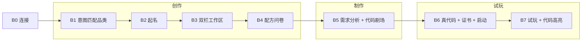

# 文三路 AI 游戏创作工坊 · 项目方案 v1.1

> **版本**：1.1（Git tag `v1.1` · 2026-06-28）  
> **定位**：K12 展厅 · AI 辅助小游戏创作与试玩 · 14 岁以下  
> **仓库**：https://github.com/DomenRaven/Wensan-Road-Ai-city-Game  
> **部署**：[`部署手册_v1.1.md`](./部署手册_v1.1.md)  
> **UI 升级核对**：[`模板引擎/6.26_甲方升级方案与LLM评估_v1.0.md`](./模板引擎/6.26_甲方升级方案与LLM评估_v1.0.md)

---

## 一、项目概述

### 1.1 产品定义

**文三路 AI 游戏创作工坊**（GameForge K12）是面向展厅的教育互动系统：儿童用自然语言选择游戏类型、填写配方问卷，系统在隔离工作区生成 Godot 游戏配置，左侧展示真实代码与操作联动高亮，右侧通过外置 Godot 窗口试玩。

**核心价值**

- 看得见「配方 → 配置 → 代码」的因果关系  
- 试玩时「操作 ↔ 代码行」即时高亮，支撑讲解员教学  
- 创作结束可领取**作品登记证书**（名称、品类、配方摘要、时间）

### 1.2 版本范围（v1.1 已交付）

| 维度 | 内容 |
|------|------|
| 游戏 | **7 款** Godot 模板（A/B 链展厅统一） |
| 前端 | A 链快玩 + B 链教育版（蓝白 UI · 横竖屏 · 证书） |
| 后端 | FastAPI 会话、配方、生成、试玩 launch、动作轮询 |
| 试玩 | 外置 Godot 4.6；Windows 下自动贴右半/下半屏 |
| 大模型 | **未接入**；B1 关键词意图 · B5 preset 分析 · 预制代码剧场 |
| 未纳入 | 联机、存档、内购、LLM 实时生成、浏览器内嵌 Godot |

### 1.3 七款游戏（展厅统一）

| # | slug | 中文名 |
|---|------|--------|
| 1 | platformer | 横版闯关 |
| 2 | shmup | 街机飞机射击 |
| 3 | survivor | 割草生存 |
| 4 | pingpong | 乒乓球 |
| 5 | fighting | 横版格斗 |
| 6 | parkour | 跑酷 |
| 7 | racing | 欢乐赛车 |

A 链、B 链、配方问卷、代码锚点、B7 演示钮、E2E 验收均限于以上 **7 款**。

---

## 二、用户与入口

| 角色 | 行为 |
|------|------|
| 儿童 | 触控大屏完成创作与试玩 |
| 讲解员 | 演示操作钮触发代码高亮 · 指引 Godot 外置窗 |
| 运维 | 启动 API + Kiosk · 配置 `GODOT_PATH` · 可选 Redis |

| 入口 | URL | 旅程 |
|------|-----|------|
| **A 链 · 快玩** | `/kiosk/` | 选品类 → 直启试玩（S0→S1→S9） |
| **B 链 · 教育创作** | `/kiosk/edu/` | B0→B7 全链（本方案主路径） |

两链共用：会话隔离 · **7 款游戏** · Godot launcher · bootstrap 校验。

---

## 三、用户流程

### 3.1 B 链教育创作（主流程）



| 阶段 | 步骤 | 用户所见 | 系统行为 |
|------|------|----------|----------|
| 准备 | **B0** | 加载动画 | 创建 session · bootstrap 校验 |
| 创作 | **B1** | 「今天想玩什么？」输入框 | `POST /intent/match-genre` 关键词匹配 7 品类 |
| 创作 | **B2** | 品类确认 + 起名 + 推荐名芯片 | 写入 `display_name` · `theme.title` |
| 创作 | **B3** | 左代码区 + 右预览/引导 | 双栏布局 · 品类 HTML 动画预览 |
| 创作 | **B4** | 完型填空 / 单选（每款 4~5 题） | `creative_templates` → `creative/answers`；**无小技能题** |
| 制作 | **B5** | 多文件代码剧场滚动 | `analyze-requirements`（preset）→ `generate/v2` → workspace |
| 试玩 | **B6** | 真 `game_config` · **作品证书** ·「开始试玩」 | `play/launch` + viewport · Godot 外置窗归位 |
| 试玩 | **B7** | 左代码高亮 · 右状态/演示钮 | Godot hooks 写 `.edu_actions.jsonl` · 前端轮询高亮 |

**三段时间轴**（顶栏）：创作（B1–B4）→ 制作（B5）→ 试玩（B6–B7）

### 3.2 A 链快玩（分流）

| 步骤 | 说明 |
|------|------|
| S0 | 可选起名 |
| S1 | 7 款游戏大卡片选品类 |
| S9 | `play/launch` 直启 L0 模板试玩 |

适用：排队体验、快速试玩；无代码区与证书。

### 3.3 布局与 Godot 分区（v1.1）

| 模式 | Kiosk 布局 | 外置 Godot 窗口 |
|------|------------|-----------------|
| **横屏** | 左 ≥45% 代码工作区 · 右引导区（虚线 `godot-zone`） | 贴屏幕右半，与引导区对齐 |
| **竖屏** | 上工作区/配方 · 下引导区 | 贴主显示器下半屏（Win32） |

归位失败时 launch 仍成功，状态卡提示手动找窗。

---

## 四、功能点明细

### 4.1 会话与隔离

| 功能 | 说明 | 状态 |
|------|------|------|
| 会话池 | 最多 10 路并发（可配置） | ✅ |
| 存储 | Redis 优先；不可用时内存降级 | ✅ |
| 工作区 | `workspace/{session_id}/` 独占副本 | ✅ |
| 模板只读 | `templates/` 不写入；仅 copy 到 workspace | ✅ |
| 释放 | release / DELETE · pagehide sendBeacon | ✅ |
| 开馆清理 | bootstrap 清理孤立 workspace | ✅ |

### 4.2 意图与配方（RECIPE · v1.1）

| 功能 | 说明 | 状态 |
|------|------|------|
| B1 意图匹配 | `intent_genre_lexicon.json` 关键词 | ✅ |
| B2 推荐名 | 每品类 4 个预制名 | ✅ |
| B4 配方问卷 | 7 款 `creative_templates`；每款 **4~5 道 tuning 题** | ✅ |
| 小技能题 | **已移除**；`enabled_skills` 保持 `[]` | ✅ |
| 锚点 | `code_anchors` 与 B7 高亮、证书配方行一致 | ✅ |
| 数值 clamp | tuning 调整 ±30% 规格内 | ✅ |

**七款游戏与配方题数**

| slug | 中文名 | B4 题数 |
|------|--------|---------|
| platformer | 横版闯关 | 5 |
| shmup | 街机飞机射击 | 5 |
| survivor | 割草生存 | 5 |
| pingpong | 乒乓球 | 5 |
| fighting | 横版格斗 | 4 |
| parkour | 跑酷 | 5 |
| racing | 赛车 | 5 |

### 4.3 制作与代码展示

| 功能 | 说明 | 状态 |
|------|------|------|
| 需求分析 | preset 路径；标记 `resolution: preset` | ✅ |
| LLM 补丁 | 接口预留；**v1.1 未启用** | — |
| generate/v2 | copytree · merge `game_config` · 返回 `code_map` | ✅ |
| 多文件剧场 | `edu_workspace_trees.json` + 预览 API 打字展示 | ✅ |
| B6 真代码 | workspace 内 `game_config` + 文件树 | ✅ |
| 代码滚动 | 创作/试玩阶段纵向可读；禁自动横滚 | ✅ |

### 4.4 试玩与教育联动

| 功能 | 说明 | 状态 |
|------|------|------|
| Godot launch | 外置进程；优先 workspace 路径 | ✅ |
| 窗口归位 | `client_viewport` + Win32（Windows） | ✅ |
| 动作上报 | `_edu/*_hooks.gd` → `.edu_actions.jsonl` | ✅ |
| 前端轮询 | `GET /play/actions?since=` | ✅ |
| 代码高亮 | `code_map` + 行号高亮 + caption | ✅ |
| 讲解员演示钮 | 七款 `GENRE_DEMO_ACTIONS` 模拟操作 | ✅ |
| 进程状态 | `play/status` 轮询运行中/已关闭 | ✅ |

**各品类 B7 演示动作（示例）**

| slug | 动作 |
|------|------|
| platformer | 跳 · 踩怪 · 捡金币 |
| shmup | 打敌机 · 吃道具 |
| survivor | 消灭 · 吸经验 · 升级 |
| pingpong | 击球 · 得分 |
| fighting | 轻拳 · 重拳 · 格挡 · 大招 |
| parkour | 跳跃 · 滑铲 · 捡金币 · 吃道具 |
| racing | 加速 · 漂移 · 完成圈 |

### 4.5 作品登记证书（RECIPE-A）

| 功能 | 说明 | 状态 |
|------|------|------|
| B6 自动展示 | 作品名 · 品类 · 时间 · 配方摘要 ≥3 行 | ✅ |
| 配方行 | 跳过 skill 题；来自 B4 答案 | ✅ |
| B7 复看 | 工具栏「查看证书」 | ✅ |
| 打印 | `@media print` 仅证书区 | ✅ |
| 视觉 | 霓虹游戏风 · 横竖屏适配 | ✅ |

### 4.6 展厅 UI（P3 · v1.1）

| 功能 | 说明 | 状态 |
|------|------|------|
| 蓝白主题 | `kiosk_edu_spec.colors` 全站 CSS 变量 | ✅ |
| 浅星空 ambient | 橙金装饰 · 不遮挡正文 | ✅ |
| 横竖屏 | `orientation.js` · breakpoint 900 | ✅ |
| 触控 | 按钮/卡片 ≥48px | ✅ |
| A 链主色 | 与 B 链品牌蓝一致 | ✅ |

### 4.7 未纳入 v1.1

| 项 | 说明 |
|----|------|
| LLM | B1 低置信兜底 · B5 llm_patch |
| SKILLS | B4 小技能勾选玩法 |
| 联机/存档/商城 | 规格禁止 |
| HTML5 内嵌 Godot | 展陈选型为外置窗 |
| Linux/macOS 窗归位 | 仅 Windows Win32 |

---

## 五、系统架构

### 5.1 运行时架构

```text
┌─────────────────────────────────────────────────────────────┐
│  浏览器 Kiosk（Chrome/Edge 全屏）                              │
│  ├─ /kiosk/          A 链静态向导                            │
│  └─ /kiosk/edu/      B 链教育版（orientation · dual-pane）    │
└──────────────────────────┬──────────────────────────────────┘
                           │ HTTP :8080 静态 + :8000 API
┌──────────────────────────▼──────────────────────────────────┐
│  FastAPI（backend/）                                           │
│  ├─ 会话 Redis / 内存                                          │
│  ├─ intent · creative · generate/v2                           │
│  ├─ edu preview · workspace 只读                               │
│  └─ play/launch · play/action · play/actions                  │
└──────────────────────────┬──────────────────────────────────┘
                           │ subprocess + Win32 归位
┌──────────────────────────▼──────────────────────────────────┐
│  Godot 4.6 外置窗口（workspace 或 templates 项目）             │
│  └─ _edu hooks → .edu_actions.jsonl → 前端高亮                 │
└─────────────────────────────────────────────────────────────┘
```

### 5.2 仓库分层

| 目录 | 职责 |
|------|------|
| `kiosk/` | 展厅前端（HTML/CSS/JS） |
| `backend/` | FastAPI 编排与 launch |
| `templates/{genre}/` | Godot 模板 · `core/` 预制 · `config/game_config.json` 可改 |
| `workspace/` | 会话运行时副本 |
| `config/` | 配方模板、锚点、kiosk 规格、意图词表 |
| `assets/` | Kenney CC0 与 code_theater 素材 |
| `05-工具脚本/` | E2E、冻结快照、Redis 安装 |

### 5.3 游戏模板（7 款）

| slug | 中文名 | 模板路径 |
|------|--------|----------|
| platformer | 横版闯关 | `templates/platformer/` |
| shmup | 街机飞机射击 | `templates/shmup/` |
| survivor | 割草生存 | `templates/survivor/` |
| pingpong | 乒乓球 | `templates/pingpong/` |
| fighting | 横版格斗 | `templates/fighting/` |
| parkour | 跑酷 | `templates/parkour/` |
| racing | 欢乐赛车 | `templates/racing/` |

每款含：`core/`（预制逻辑，不可改）· `config/game_config.json`（问卷写入 workspace）· `_edu/*_hooks.gd`（B7 动作上报）。

### 5.4 主要 API

| 域 | 代表路径 |
|----|----------|
| 健康 | `GET /health` · `GET /bootstrap` |
| 会话 | `POST/GET/DELETE /sessions` · `POST .../release` |
| 意图 | `POST /intent/match-genre` |
| 配方 | `GET /creative/templates/{genre}` · `POST .../creative/answers` |
| 制作 | `POST .../analyze-requirements` · `POST .../generate/v2` |
| 工作区 | `GET .../workspace/game-config` · `GET .../workspace/file` |
| 预览 | `GET /edu/preview/{genre}/file` |
| 试玩 | `POST .../play/launch` · `GET .../play/status` · `POST .../play/action` · `GET .../play/actions` |

OpenAPI：`http://127.0.0.1:8000/docs`

---

## 六、数据流（B 链一次创作）

```text
1. 儿童输入「马里奥闯关」
      → intent 匹配 platformer
2. 起名「星星大冒险」+ B4 选「跳得高 / 敌人快」等
      → creative_answers 写入 session
3. analyze-requirements → 全部 preset
4. generate/v2
      → copy templates/platformer → workspace/{uuid}/
      → merge tuning → game_config.json
      → 返回 code_map
5. B5 剧场展示模板代码片段（只读表演）
6. B6 展示 workspace 真代码 + 证书 + launch(viewport)
      → Godot 启动 + 窗体归位
7. B7 儿童/讲解员操作
      → hooks 写 action_id
      → 前端高亮 config 或 core 对应行
```

---

## 七、技术栈

| 类别 | 选型 |
|------|------|
| 游戏引擎 | Godot **4.6.x** Standard · GDScript |
| 后端 | Python 3.11+ · FastAPI · uvicorn · pydantic v2 |
| 会话 | Redis 5.x（推荐）或内存 |
| 前端 | 原生 HTML/CSS/JS（无构建链） |
| 操作系统 | Windows 10/11（完整 Godot 归位） |
| 版本管理 | Git · tag `v1.1` |

依赖清单见 [`backend/requirements.txt`](../backend/requirements.txt) 与 [`部署手册_v1.1.md`](./部署手册_v1.1.md)。

---

## 八、质量与冻结

| 项 | 说明 |
|----|------|
| E2E | batch 6/6 · browser 7/7 · 证书 · P3 launch viewport |
| pytest | play · launch · window_layout |
| 冻结 | 各品类 `frozen_genre_*.json` · RECIPE `frozen_recipe_v1.json` |
| core | `templates/*/core/**` v1.1 无改动 |

收工评审：[`模板引擎/评审记录/6.26_P3_收工.md`](./模板引擎/评审记录/6.26_P3_收工.md)

---

## 九、相关文档索引

| 文档 | 用途 |
|------|------|
| **本文** | 总体方案 · 功能 · 架构 · 流程 |
| [`部署手册_v1.1.md`](./部署手册_v1.1.md) | 环境安装与展厅启动 |
| [`模板引擎/6.24_B链教育版用户旅程与需求规格_v1.0.md`](./模板引擎/6.24_B链教育版用户旅程与需求规格_v1.0.md) | B0–B7 逐步规格 |
| [`模板引擎/6.26_甲方升级方案与LLM评估_v1.0.md`](./模板引擎/6.26_甲方升级方案与LLM评估_v1.0.md) | P3 UI/Godot 交付核对 |
| [`模板引擎/6.26_RECIPE_配方定制与作品证书_需求规格_v1.0.md`](./模板引擎/6.26_RECIPE_配方定制与作品证书_需求规格_v1.0.md) | 配方与证书 |
| [`模板引擎/快照/6.26_P3_收工后状态快照_v1.0.md`](./模板引擎/快照/6.26_P3_收工后状态快照_v1.0.md) | v1.1 代码基线 |
| [`CHANGELOG.md`](../CHANGELOG.md) | 版本变更记录 |

---

*v1.1 · 2026-06-28 · 与仓库 tag v1.1 一致*
